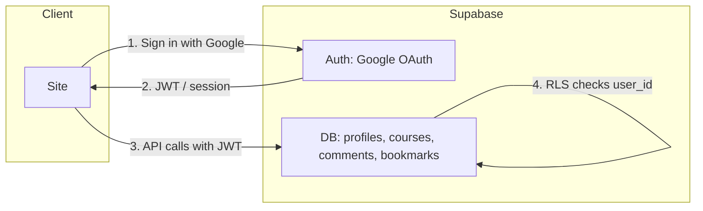
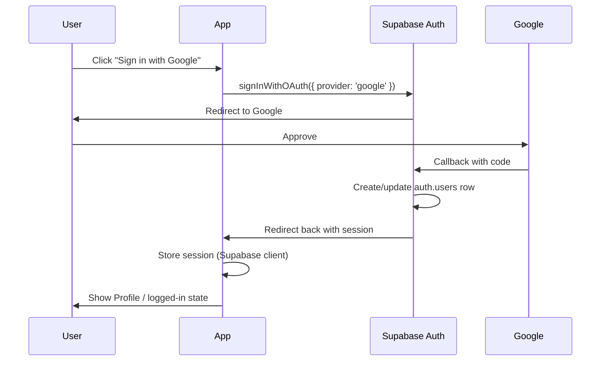
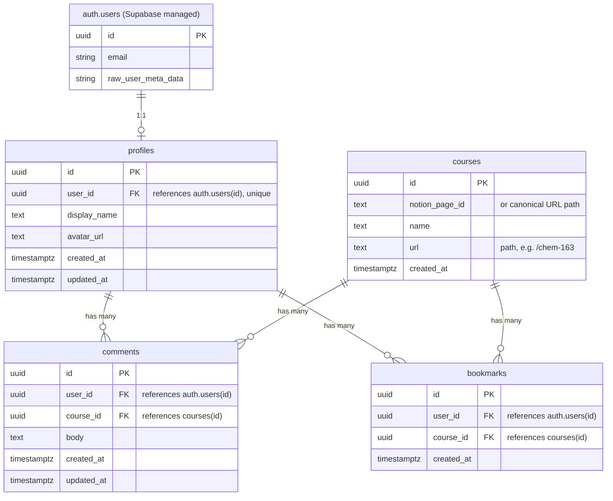

# Supabase Auth & Data Design

## High-level flow



## Auth flow (Google)



## Database tables



## Table definitions (SQL for Supabase)

### Phase 1: Auth + profiles

**profiles** — one row per user; synced from `auth.users` via trigger or on first load.

```sql
create table public.profiles (
  id uuid primary key default gen_random_uuid(),
  user_id uuid references auth.users(id) on delete cascade unique not null,
  display_name text,
  avatar_url text,
  created_at timestamptz default now(),
  updated_at timestamptz default now()
);

-- RLS: users can read/update own profile
alter table public.profiles enable row level security;

create policy "Users can view own profile"
  on public.profiles for select
  using (auth.uid() = user_id);

create policy "Users can update own profile"
  on public.profiles for update
  using (auth.uid() = user_id);

create policy "Users can insert own profile"
  on public.profiles for insert
  with check (auth.uid() = user_id);

-- Optional: trigger to create profile on signup (or create from app on first load)
create or replace function public.handle_new_user()
returns trigger as $$
begin
  insert into public.profiles (user_id, display_name, avatar_url)
  values (
    new.id,
    coalesce(new.raw_user_meta_data->>'full_name', new.raw_user_meta_data->>'name', split_part(new.email, '@', 1)),
    new.raw_user_meta_data->>'avatar_url'
  );
  return new;
end;
$$ language plpgsql security definer;

create trigger on_auth_user_created
  after insert on auth.users
  for each row execute function public.handle_new_user();
```

### Phase 2: Courses (reference only; course data still from Notion)

**courses** — store only what we need for comments/bookmarks (name + url). Insert when user first comments or bookmarks.

```sql
create table public.courses (
  id uuid primary key default gen_random_uuid(),
  notion_page_id text unique,  -- or use url as natural key
  name text not null,
  url text not null,
  created_at timestamptz default now()
);

-- Public read so we can resolve course by url
alter table public.courses enable row level security;
create policy "Anyone can read courses"
  on public.courses for select
  using (true);
create policy "Authenticated users can insert courses"
  on public.courses for insert
  with check (auth.role() = 'authenticated');
```

### Phase 2: Comments & bookmarks

```sql
create table public.comments (
  id uuid primary key default gen_random_uuid(),
  user_id uuid references auth.users(id) on delete cascade not null,
  course_id uuid references public.courses(id) on delete cascade not null,
  body text not null,
  created_at timestamptz default now(),
  updated_at timestamptz default now()
);

create table public.bookmarks (
  id uuid primary key default gen_random_uuid(),
  user_id uuid references auth.users(id) on delete cascade not null,
  course_id uuid references public.courses(id) on delete cascade not null,
  created_at timestamptz default now(),
  unique(user_id, course_id)
);

-- RLS for comments and bookmarks: users CRUD own rows; anyone can read comments
alter table public.comments enable row level security;
alter table public.bookmarks enable row level security;
-- (policies omitted for brevity; same pattern as profiles)
```

## What stays the same

- **Course content** — still loaded from Notion API; no change to `resolveNotionPage`, `getSiteMap`, or course pages.
- **Course list / sitemap** — still from Notion.
- We only **record** in Supabase: course `name` + `url` (or notion_page_id) when we need to attach comments/bookmarks.

## What you need to provide

1. **Supabase project**
   - Project URL (e.g. `https://xxxx.supabase.co`)
   - Anon/public key (safe for client)

2. **Run the profiles migration**
   - In Supabase Dashboard: SQL Editor → New query → paste and run the contents of `supabase/migrations/001_profiles.sql`.
   - This creates the `profiles` table and the trigger that creates a profile row when a user signs up.

3. **Google OAuth**
   - In Supabase Dashboard: **Authentication** → **Providers** → **Google** → Enable, add **Client ID** and **Client Secret** from Google Cloud Console.
   - In **Google Cloud Console**: create an OAuth 2.0 Client (Web application), add authorized redirect URI: `https://<project-ref>.supabase.co/auth/v1/callback`.

4. **Env vars** (e.g. `.env.local`):
   - `NEXT_PUBLIC_SUPABASE_URL=https://xxxx.supabase.co`
   - `NEXT_PUBLIC_SUPABASE_ANON_KEY=your-anon-key`

After that, sign-in and the profile page will work.

### Phase 2: Courses, comments, bookmarks, annotations

Run the second migration in Supabase SQL Editor: `supabase/migrations/002_courses_comments_bookmarks_annotations.sql`. This creates:

- **courses** — one row per course page (url, name); inserted when a user first comments, bookmarks, or annotates.
- **comments** — course-level comments (only from the Course Activity section).
- **bookmarks** — saved courses (Save course button on course pages).
- **annotations** — per-section annotations (from the Annotation widget on a specific tab/section).

Course content still comes from Notion; we only store course identity and activity in Supabase.
