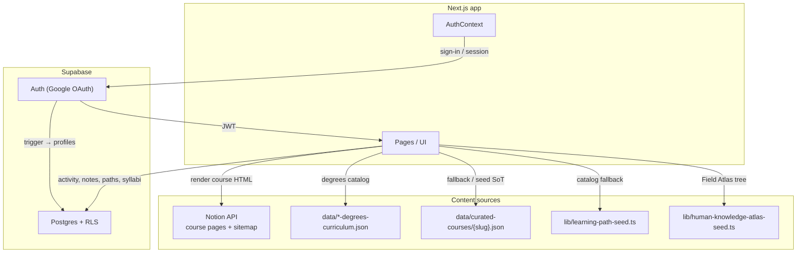
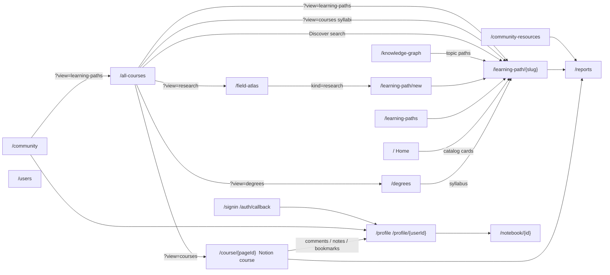
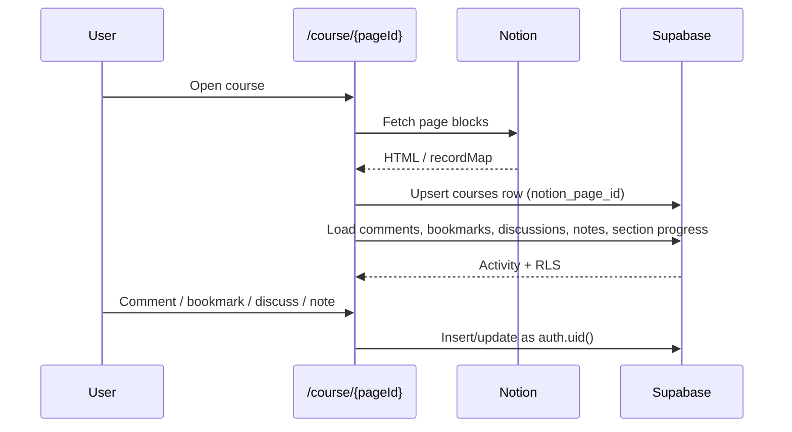
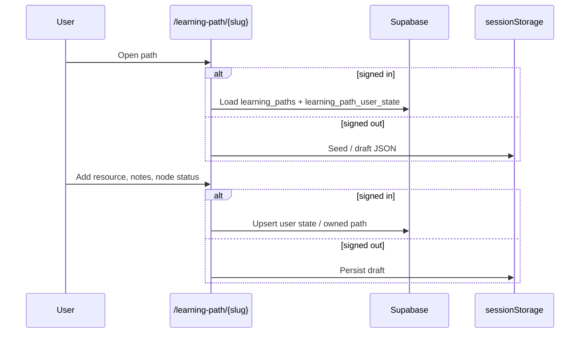

# Architecture

## Big picture

Coursetexts is a Next.js site with four content pillars:

1. **Official Notion courses** — professor course pages from Notion at `/course/{pageId}`; comments, discussions, bookmarks, and notes in Supabase
2. **Course learning paths** — degree syllabi (topic tree + sequenced resources) stored as `learning_paths` rows with `kind = course`
3. **Community / research learning paths** — goal-based maps people publish, keep private, or open for collaboration
4. **Community / profiles** — users, follows, notebooks, resource library, Field Atlas

Everything that is **not** a Notion professor course already lives on `learning_paths` and `/learning-path/{slug}`. Official Notion courses are still a separate CMS. A later pass will migrate those onto `learning_paths` too — that work is not started. See [Future](#future-official-notion-courses).

Signed-out users still see catalog content. Writes (notes, path edits, votes) fall back to `localStorage` / `sessionStorage` until sign-in.

## Home (`/`)

Custom landing page (not the raw Notion root). Section order:

1. Header
2. Hero + search — subject chips (Science, Math, Sociology, English) and learning-path topic chips (Languages, Coding, Creative, Making) scroll in a looping marquee beside the school logos; chips filter the home catalog (subjects → university courses, topics → community paths)
3. Dot-grid of featured Notion courses
4. **A new educational interface. Learning paths.** — copy plus a looping visual (`HomeLearningPathDiagram`): goal in a box, then connected concepts, then three stacked resources that become a Resource list (faint video / paper / exercise / book icons on the right of each resource), then notes, then a commit/remind → **Josh · Committed** and a Notify badge. Decorative only; it does not create a path. `/community` still uses the static `LearningPathSchemaDiagram`.
5. **Try learning paths from our community** (catalog paths). Community copy sits to the left of **View all**, with a link to `/community`. Topic filters live in the hero marquee (not a second chip row here).
6. **A community for self-learners** (`HomeSocialLearningSection`) — CTA **Learn independently, not alone** (profile when signed in, sign-in when not).
7. **Learn from advanced university courses** (Notion courses, subject chips). The publishing-pipeline copy sits to the left of **View all**.
8. Donate / footer

Course cards come from the Notion sitemap in `getStaticProps`. Community path cards come from `listCatalogLearningPaths()` (seeded catalog, merged with any extra rows in `lib/learning-path-seed.ts`).

## Site header (`HomeHeader`)

Shared chrome on home, catalog, community, profile, course, and about pages. Desktop nav is **Explore** · **Create a path** · **Community** · **About**.

- **Explore** → `/all-courses` (Discover)
- **Create a path** opens `CreateLearningPathModal` (workflow: describe your goal → editable draft → add resources → save or publish), then `/learning-path/new?goal=`
- **Community** → `/community`
- **About** is a dropdown (no `/about` landing). Items:

| Item | Destination |
| ---- | ----------- |
| Why Coursetexts | `/manifesto` |
| Our Story & Team | `/about` (Notion) |
| How We Publish | `/process` (Notion) |
| For Professors | `/professors` |
| Blog & Research | `https://blog.coursetexts.org` |
| Support Coursetexts | `/support` |

Donate is not a top-level nav item; it lives under About.

## All Courses (`/all-courses`)

The Guyot title follows the selected catalog: **Discover** (default; omit `view`, or `?view=all`), **All Learning Paths**, **All University Courses**, **Degree Curricula**, or **Research Questions**. Under search, **All | Learning Paths | University Courses | Degrees | Research** is a visible text filter. Search `q` is shared. A query with no type filter searches every catalog together: the most goal-relevant result is the **Best match**, then remaining hits are grouped by type (related learning paths, university courses, degree curricula, research questions). Filled `kind=course` syllabi can appear under related learning paths when they match the goal. Subject chips apply only to the university-courses view; topic chips apply only to the learning-paths view; school logos show on Discover and University Courses.

**Discover (default)**

1. With a query: best match, then grouped results across learning paths (community + research + matching syllabi), official Notion courses, UG/grad degree curricula, and Field Atlas / Explore questions. A brown **Can't find what you're looking for? Create your own path →** card always sits at the bottom (matches and empty search). It opens the create-path modal.
2. With no query: a short browse of each type (paths, university courses, degrees, research). Full syllabus grid stays on University Courses. The create-path promo sits in the learning-paths grid.

**University Courses view (`?view=courses`)**

1. Official Notion courses (capped at 14 until the user searches or picks subject chips)
2. Filled `kind=course` syllabi: every `data/curated-courses/{slug}.json` with a topic tree, merged with `listCourseLearningPaths()` (`is_filled`). Empty catalog stubs stay out. Brown degrees promo in the top-right of that syllabus grid → `/degrees` (new tab)
3. University-affiliation disclaimer
4. Divider

**Learning-paths view (`?view=learning-paths`)**

Public `community` and `research` rows via `listNonCourseLearningPaths()` — **not** `kind=course`, so the ~1800 empty syllabus stubs never appear. With no query, a **Create your own path →** promo sits in the top-right of that grid. Any search (`q`) — including ones with matches — ends with that same create-path card at the bottom; empty search shows “No existing learning paths matched your search,” a hairline, then the card.

**Degrees / Research views**

`?view=degrees` searches UG/grad curricula. `?view=research` searches Field Atlas questions (plus Explore Questions). These filters are explicit; homepage search does not set them. A search in either view also ends with the create-path card. University Courses search (`?view=courses&q=`) does too.

## Community (`/community`)

Two explainers, then trending lists.

1. **Learning paths** — copy plus `CommunitySchema` (goal graph). Each step has **Discussions**.
2. **Community Collab Resources** — copy plus `ResourceVoteSchemaDiagram`: numbered study order (`1 2 3`) is independent of ↑ votes for quality (highest vote is deliberately not on item 1). CTA → `/all-courses?view=learning-paths`.

## App surfaces

| Surface                    | Route(s)                                                         | Primary data                                                                                                                                                                                                                                                                                                                                                                                                    |
| -------------------------- | ---------------------------------------------------------------- | --------------------------------------------------------------------------------------------------------------------------------------------------------------------------------------------------------------------------------------------------------------------------------------------------------------------------------------------------------------------------------------------------------------- |
| Home                       | `/`                                                              | Notion sitemap + catalog learning paths                                                                                                                                                                                                                                                                                                                                                                         |
| Notion courses             | `/course/{pageId}`, `/[pageId]`, `/c/*`                          | Notion + `courses` / activity / `course_notes`. Shared bottom **StepNavBar**: Previous (hidden on first), **N of M**, **Mark as explored** / **✓ Explored**, **Next →** / **Finish path**. **Commit & Remind Me** on the **General** tab (`course:{notion_page_id}`). TOC uses the same light-blue stroke check as learning paths when a section is explored. Pin-nav **Continue** uses cached TOC labels, or `POST /api/course-toc` headings when the course has not been opened in this browser. |
| Catalog browse             | `/all-courses`                                                   | Visible **All \| Learning Paths \| University Courses \| Degrees \| Research** filter. Omit `view` (or `?view=all`) for unified Discover: a query ranks a **Best match** then groups the rest by type, and always ends with **Can't find what you're looking for? Create your own path →**. `?view=courses` official Notion + filled syllabi + degrees promo. `?view=learning-paths` public `community` + `research` via `listNonCourseLearningPaths()`. `?view=degrees` / `?view=research` for those catalogs only. Any `q` on those views also shows the create-path card at the bottom.                                                                                                                                                                                                 |
| Degrees                    | `/degrees`                                                       | UG / grad JSON                                                                                                                                                                                                                                                                                                                                                                                                  |
| Course learning path       | `/learning-path/{slug}` (`kind=course`)                          | Same shell; **Overview** (Resources + Recommended Path) then syllabus tree; **Start learning path** on Overview opens the first topic (or Resources); `learning_paths.data` (`curated_*` backup)                                                                                                                                                                                                                                                                                                                                       |
| Community / research paths | `/learning-paths`, `/learning-path/{slug}`, `/learning-path/new` | `learning_paths` + `learning_path_user_state`. Left outline: **Overview** (Resources only; no Why; **Start learning path** on the step bar), then the accordion topic tree (vertical line for nested steps; light-blue stroke check when explored). Hero: publisher photo · Public/Collab/Private · Published; Save/••• chip (bookmark icon). **•••** has Share (copy link), Report; owners change visibility. While private, owners can **Invite** a Coursetexts account by email (no email is sent; access is a matching signed-in address). The owner and those invitees can add/edit nodes; invitee-added resources show **Added by you**. A private URL you cannot read shows a gate; signed-in visitors can **Request to join**. On Collab, visitors suggest resources (dotted card); the owner **Accept**s them onto the official list. **Context** opens a dialog with the copied LLM prompt (current step, numbered outline with whys, goal) and how to paste it into a chat. Auto-fill shows a watering-plant popup until the outline is ready. Below the path, **Discuss this with others?** sits beside **People on this learning path** (study-circle members). Topic threads are **Discussions**. |
| Field Atlas                | `/field-atlas`                                                   | Seeded atlas tree; can start a `kind=research` path                                                                                                                                                                                                                                                                                                                                                             |
| Knowledge graph            | `/knowledge-graph`                                               | Frozen snapshot in `data/knowledge-graph.json`. Page does not harvest or call `GET /api/knowledge-graph`. LLM clustering is typed but not called yet.                                                                                                                                                                                          |
| Community explainer        | `/community`                                                     | Learning-path copy + structure diagram; collab-resources copy + vote/order diagram; trending lists                                                                                                                                                                                                                                                                                                              |
| About                      | `/manifesto`, `/about`, `/process`, `/professors`, `/support`    | Header About dropdown. Manifesto is the custom Why page; `/about` and `/process` are Notion overrides; professors + support are site pages. Blog is `blog.coursetexts.org`.                                                                                                                                                                                                                                    |
| Resource library           | `/community-resources`                                           | `resources`, `knowledge_components`, `search_community`                                                                                                                                                                                                                                                                                                                                                         |
| Reports                    | `/reports`                                                       | `content_reports`. Open while testing; later `coursetexts.info@gmail.com` only.                                                                                                                                                                                                                                                                                                                                 |
| Profile / social           | `/profile`, `/profile/{userId}`, `/users`                        | profiles, follows, links, notebooks, owned/saved paths. Header pin nav (saved courses / paths) also shows on `/profile`. Hover a pin-nav row for **N of M concepts/topics explored**, the next topic, and **Continue →** (`?node=` on paths, `?topic=` on official Notion courses). Tabs: **Learning** (pills: **Courses** · **Learning paths** · **By you** · **Committed**; own-profile tag order: sprout **N day streak** (hidden at 0, mocked for now) left of muted **% complete** (hidden at 0%) left of **Commit**, then **Notify** on committed cards) · **Knowledge** (topic list) · **Notes** (private topic notes; `/profile` only; editable; **Open** → that topic with the notes panel) · **Bookmarks** · **Activity** (pills: **Feed** · **Your activity**, plus search). Shared SEARCH width on those tabs. |
| Auth                       | `/signin`, `/auth/callback`                                      | Google OAuth. Return to the gated page/section (`sessionStorage` / `localStorage` + `?node=` / `?topic=` / `?notes=1` / `?annotations=1` for Discussions). Callback reads the path once. Fallback `/`, not `/profile`.                                                                                                                                                                                          |

Legacy URLs:

- `/course-learning-path/{slug}` and `/curated-course/{slug}` → `/learning-path/{slug}` (Next.js redirect)
- `/course-videos?slug=` client-redirects to `/learning-path/{slug}`

## How a Notion course page uses the DB

Notion owns the **reading**. Supabase stores **people activity** keyed by Notion page id (`courses.notion_page_id`).

The in-page **Community Wall** TOC tab was removed. `course_resources` tables remain for profile feed / bookmarks of older wall posts.

Comments and bookmarks on **learning paths** and **course learning paths** reuse the same `courses` / `comments` / `bookmarks` tables with synthetic ids:

- `learning-path:{slug}`
- `course-learning-path:{slug}`

## How a community learning path uses the DB

Catalog rows (`is_catalog = true`, `owner_id` null) are public. User-owned rows default to `visibility = private` until the owner publishes (`public`) or opens collaboration (`collaborative`). Private → public/collab requires at least 2 resources and a filled why on every topic; see [learning-paths.md](./learning-paths.md#visibility). `is_private` stays in sync with `visibility = private`. The hero date line shows Public / Collab / Private · Published; owners change visibility from **•••**. Adding or editing nodes is owner-only on public and collaborative paths. On a private path the owner can invite an existing Coursetexts user by email (`learning_path_invites`); that person can read and co-edit the outline while it stays private. Invitees’ own official resources show **Added by you**. On a collaborative path, visitors suggest resources (dotted card); the owner **Accept**s them onto the official list. No invitation email is sent. A signed-in visitor who cannot open a private URL can **Request to join** (`learning_path_join_requests`); the owner sees that email on the path and on `/profile`.

## How a course learning path uses the DB

Degree pages link to `/learning-path/{slug}`. The unified route always renders the `LearningPath` shell. When `kind = course`, that shell uses the course kicker and syllabus outline (**Overview**, then the topic tree); the main pane is still the syllabus topic / video UI. The page loads `learning_paths.data` (syllabus JSON). If that row is missing or has an empty topic tree, the client falls back to `curated_*` tables, then `data/curated-courses/{slug}.json` / `lib/course-learning-path-seed.ts`.

Adding a resource on a syllabus node patches `learning_paths.data` and also publishes a row in site-wide `resources` (for `/community-resources`). Catalog course rows stay writable for signed-in users (same as before). `curated_*` tables are not dropped; they are a backup and the migrate/seed source.

## Learning on a profile

`/profile` **Learning** lists owned, saved, pinned, and official Notion courses. Community/research/course-kind cards show muted byline text under the title: **Created by you · Private** (or Public / Collaborative) for paths you made, and **By {name} · Public** for saved paths. Pinned Coursetexts syllabi show **By Coursetexts · Public**. Official Notion courses show **By {professors} · {school} · Public** when the course hero has been opened (professors + school are remembered locally), otherwise **By {school} · Public** or **By Coursetexts · Public**. Action tags stay on the right: Saved, then a muted sprout **N day streak** tag when the streak is greater than 0 (mocked on a few titles for now), then a muted **% complete** tag when there is progress (hidden at 0%), then **Commit**, then **Notify** (own profile, committed items only). Frequency uses the site `FormSelect`. Cadence is stored on `learning_path_commitments` (`reminder_frequency`, `reminder_minute`, `reminder_timezone`); sending notifications is not built yet. Other people’s profiles do not show Commit, Notify, or mock streaks. See [learning-paths.md](./learning-paths.md).

## Knowledge on a profile

Finishing a community, research, or course path records unique topic labels on `user_knowledge_topics` and may ingest structural edges plus path occurrences into the shared catalog. `/knowledge-graph` maps those topics to the learning paths they reoccur in. Newly explored topics (and finishing the whole map) ask for learner-entered duration and a 0–100% enjoyment rating (`learning_path_ratings`). The Knowledge tab list and the path **What you learned** row are documented in [knowledge.md](./knowledge.md). A daily Gemini job that would add extra catalog edges is **in the repo but not scheduled**. The next LLM step is clustering similar labels across paths.

## Notes on a profile

`/profile` has a **Notes** tab (not shown on `/profile/{userId}`). It lists the signed-in user's private TipTap notes from Notion `course_notes` and from `learning_path_user_state` (plus leftover `curated_course_notes`). Opening a row lets you edit the note in place. **Export PDF** on the notes toolbar downloads the current note as a PDF. **Open** goes to that topic on the course or learning path (`?node=` or `?topic=`) and opens the notes side panel (`?notes=1`).

**Activity** uses the same pill style as Learning (**Feed** · **Your activity**) plus the shared SEARCH field. Requests to join your private learning paths appear in the Feed (and as a banner at the top of your profile) with Invite / Dismiss. They are not counted in the header unread-replies badge.

## Reports (`/reports`)

Users can flag **discussions**, **comments**, **learning paths**, and **uploaded resources**. On a learning-path hero, **•••** opens **Report**. Resource rows still expose a flag. Rows land in `content_reports` and show on `/reports`. That dashboard is **open while testing**; later it should be limited to `coursetexts.info@gmail.com` (`REPORTS_DASHBOARD_OPEN` in `lib/content-reports.ts`).

## Key conventions

- **Browser client** uses the anon key + user JWT only (`lib/supabase.ts`). RLS is the ACL.
- **`profiles.user_id`** is the auth uid everywhere (not `profiles.id`).
- **Official Notion courses** use `courses.notion_page_id` (text PK) and stay at `/course/{pageId}` until a future migrate.
- **All non-Notion paths** share `learning_paths.slug`. One `/learning-path/{slug}` shell: `kind` selects the title kicker and left outline (`community` / `research` → goal graph, `course` → syllabus tree).
- **Service role** is for seed scripts and (if re-enabled) the knowledge-graph cron. Never the browser.

## Future: official Notion courses

`027` put degree syllabi on `learning_paths`. **Official Notion courses are next, not now.**

They still render from the Notion API at `/course/{pageId}`. Activity is keyed by the real Notion page id on `courses`. Do not copy those pages onto `learning_paths` in this schema, and do not merge activity prefixes (`learning-path:`, `course-learning-path:`, Notion ids) — that would mix or drop comment threads.

When that migrate happens, the goal is one identity table for every Coursetexts course: community, research, degree syllabus, and professor/Notion courses. Until then, treat Notion as a separate CMS.

## Future: Job Skills and Life Skills atlases

Field Atlas (`/field-atlas`) is the only atlas page today. `/job-skills-atlas` and `/life-skills-atlas` are **not built**. Do not treat those URLs as live product until those pages exist.
