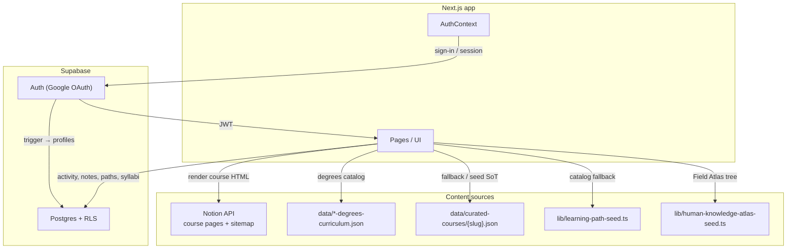
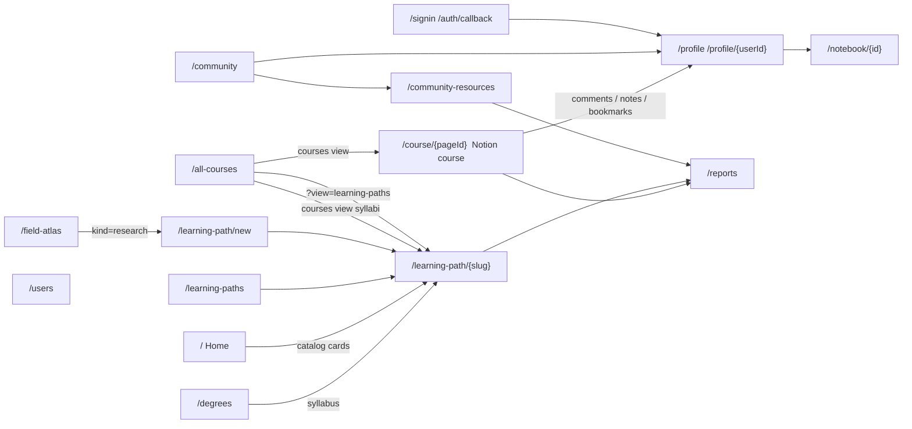
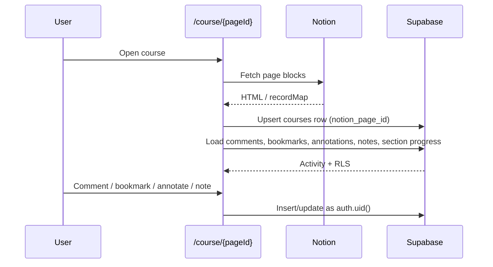
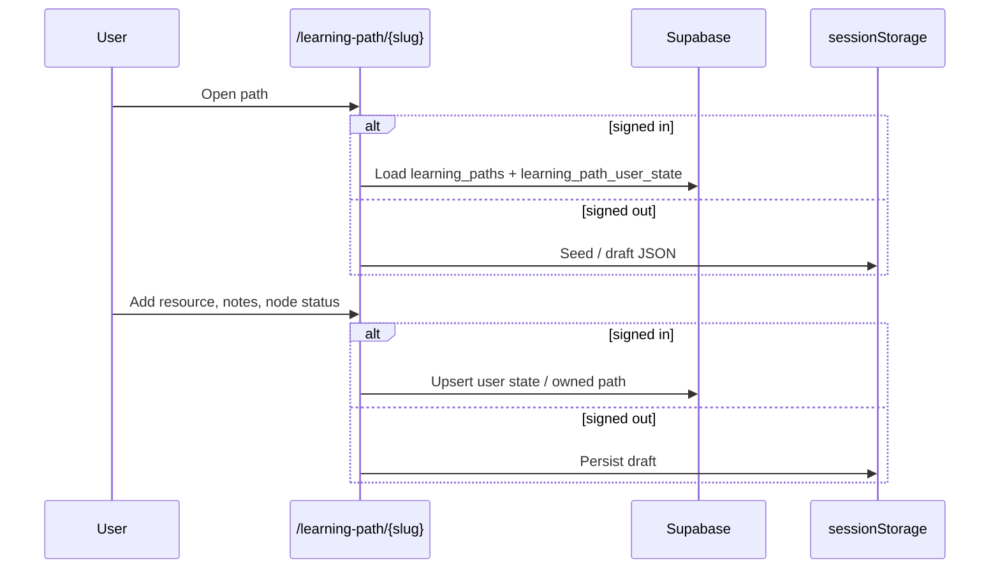

# Architecture

## Big picture

Coursetexts is a Next.js site with four content pillars:

1. **Official Notion courses** — professor course pages from Notion at `/course/{pageId}`; comments, annotations, bookmarks, and notes in Supabase
2. **Course learning paths** — degree syllabi (topic tree + sequenced resources) stored as `learning_paths` rows with `kind = course`
3. **Community / research learning paths** — goal-based maps people publish, keep private, or open for collaboration
4. **Community / profiles** — users, follows, notebooks, resource library, Field Atlas

Everything that is **not** a Notion professor course already lives on `learning_paths` and `/learning-path/{slug}`. Official Notion courses are still a separate CMS. A later pass will migrate those onto `learning_paths` too — that work is not started. See [Future](#future-official-notion-courses).

Signed-out users still see catalog content. Writes (notes, path edits, votes) fall back to `localStorage` / `sessionStorage` until sign-in.

## Home (`/`)

Custom landing page (not the raw Notion root). Section order:

1. Header
2. Hero + search
3. Dot-grid of featured Notion courses
4. **What is a learning path?**
5. **Try courses from top schools** (Notion courses, subject chips)
6. **Try learning paths from our community** (catalog paths)
7. **Coursetexts is social learning**
8. Learn something new / donate / blog / footer

Course cards come from the Notion sitemap in `getStaticProps`. Community path cards come from `listCatalogLearningPaths()` (seeded catalog, merged with any extra rows in `lib/learning-path-seed.ts`).

## All Courses (`/all-courses`)

The Guyot title is a dropdown: **All Courses** (default) or **All Learning Paths**. The choice is `?view=learning-paths` (omit `view` for courses). Search `q` is shared. Subject chips and school logos apply only to the courses view.

**Courses view**

1. Official Notion courses (capped at 14 until the user searches or picks subject chips)
2. University-affiliation disclaimer
3. Divider
4. Filled `kind=course` syllabi: every `data/curated-courses/{slug}.json` with a topic tree, merged with `listCourseLearningPaths()` (`is_filled`). Empty catalog stubs stay out.
5. Brown degrees promo in the top-right of that syllabus grid → `/degrees` (new tab)

**Learning-paths view**

Public `community` and `research` rows via `listNonCourseLearningPaths()` — **not** `kind=course`, so the ~1800 empty syllabus stubs never appear. Three atlas callouts stack in the right column (Field, Job Skills, Life Skills). A search with no matches shows “No existing learning paths matched your search,” a button that opens the create-path modal, a hairline, then those three callouts in one row.

`/field-atlas` exists. `/job-skills-atlas` and `/life-skills-atlas` are linked from the cards but are **not pages yet**.

## Community (`/community`)

Two explainers, then trending lists.

1. **Learning paths** — copy plus `CommunitySchema` (goal graph).
2. **Community Collab Resources** — copy plus `ResourceVoteSchemaDiagram`: numbered study order (`1 2 3`) is independent of ↑ votes for quality (highest vote is deliberately not on item 1). CTA → `/community-resources`.

## App surfaces

| Surface | Route(s) | Primary data |
|---------|----------|--------------|
| Home | `/` | Notion sitemap + catalog learning paths |
| Notion courses | `/course/{pageId}`, `/[pageId]`, `/c/*` | Notion + `courses` / activity / `course_notes` |
| Catalog browse | `/all-courses` | Title toggle. Courses: Notion + filled `kind=course` syllabi (`is_filled`) + degrees promo. Learning paths (`?view=learning-paths`): public `community` + `research` via `listNonCourseLearningPaths()` + atlas callouts. |
| Degrees | `/degrees` | UG / grad JSON |
| Course learning path | `/learning-path/{slug}` (`kind=course`) | Same shell; syllabus outline + `learning_paths.data` (`curated_*` backup) |
| Community / research paths | `/learning-paths`, `/learning-path/{slug}`, `/learning-path/new` | `learning_paths` + `learning_path_user_state` |
| Field Atlas | `/field-atlas` | Seeded atlas tree; can start a `kind=research` path |
| Community explainer | `/community` | Learning-path copy + structure diagram; collab-resources copy + vote/order diagram; trending lists |
| Resource library | `/community-resources` | `resources`, `knowledge_components`, `search_community` |
| Reports | `/reports` | `content_reports`. Open while testing; later `coursetexts.info@gmail.com` only. |
| Profile / social | `/profile`, `/profile/{userId}`, `/users` | profiles, follows, links, notebooks, owned/saved paths. Tabs: **Learning** (pills: **Courses** · **Learning paths** · **By you** · **Committed**) · **Knowledge** (list + graph) · **Notes** (private topic notes; `/profile` only; editable; **Open** → that topic with the notes panel) · **Bookmarks** · **Activity** (pills: **Feed** · **Your activity**, plus search). Shared SEARCH width on those tabs. |
| Auth | `/signin`, `/auth/callback` | Supabase Auth. `redirectTo` is `{origin}/auth/callback`; allowlist localhost or local Google sign-in lands on the Site URL. |

Legacy URLs:

- `/course-learning-path/{slug}` and `/curated-course/{slug}` → `/learning-path/{slug}` (Next.js redirect)
- `/course-videos?slug=` client-redirects to `/learning-path/{slug}`

## How a Notion course page uses the DB

Notion owns the **reading**. Supabase stores **people activity** keyed by Notion page id (`courses.notion_page_id`).

The in-page **Community Wall** TOC tab was removed. `course_resources` tables remain for profile feed / bookmarks of older wall posts.

Comments and bookmarks on **learning paths** and **course learning paths** reuse the same `courses` / `comments` / `bookmarks` tables with synthetic ids:

- `learning-path:{slug}`
- `course-learning-path:{slug}`

## How a community learning path uses the DB

Catalog rows (`is_catalog = true`, `owner_id` null) are public. User-owned rows default to `visibility = private` until the owner publishes (`public`) or opens collaboration (`collaborative`). `is_private` stays in sync with `visibility = private`.

## How a course learning path uses the DB

Degree pages link to `/learning-path/{slug}`. The unified route always renders the `LearningPath` shell. When `kind = course`, that shell uses the course kicker and syllabus outline; the main pane is still the syllabus topic / video UI. The page loads `learning_paths.data` (syllabus JSON). If that row is missing or has an empty topic tree, the client falls back to `curated_*` tables, then `data/curated-courses/{slug}.json` / `lib/course-learning-path-seed.ts`.

Adding a resource on a syllabus node patches `learning_paths.data` and also publishes a row in site-wide `resources` (for `/community-resources`). Catalog course rows stay writable for signed-in users (same as before). `curated_*` tables are not dropped; they are a backup and the migrate/seed source.

## Knowledge on a profile

Finishing a community, research, or course path records unique topic labels on `user_knowledge_topics` and may ingest structural edges into the shared catalog. Newly explored topics (and finishing the whole map) ask for learner-entered duration and a 0–100% enjoyment rating (`learning_path_ratings`). The Knowledge tab List / Graph and the path **What you learned** row are documented in [knowledge.md](./knowledge.md). A daily Gemini job that would add extra catalog edges is **in the repo but not scheduled**.

## Notes on a profile

`/profile` has a **Notes** tab (not shown on `/profile/{userId}`). It lists the signed-in user's private TipTap notes from Notion `course_notes` and from `learning_path_user_state` (plus leftover `curated_course_notes`). Opening a row lets you edit the note in place. **Open** goes to that topic on the course or learning path (`?node=` or `?topic=`) and opens the notes side panel (`?notes=1`).

**Activity** uses the same pill style as Learning (**Feed** · **Your activity**) plus the shared SEARCH field.

## Reports (`/reports`)

Users can flag **annotations**, **comments**, **learning paths**, and **uploaded resources**. Hover a card (or the date on a learning-path hero) and send a reason. Rows land in `content_reports` and show on `/reports`. That dashboard is **open while testing**; later it should be limited to `coursetexts.info@gmail.com` (`REPORTS_DASHBOARD_OPEN` in `lib/content-reports.ts`).

## Key conventions

- **Browser client** uses the anon key + user JWT only (`lib/supabase.ts`). RLS is the ACL.
- **`profiles.user_id`** is the auth uid everywhere (not `profiles.id`).
- **Official Notion courses** use `courses.notion_page_id` (text PK) and stay at `/course/{pageId}` until a future migrate.
- **All non-Notion paths** share `learning_paths.slug`. One `/learning-path/{slug}` shell: `kind` selects the title kicker and left outline (`community` / `research` → goal graph, `course` → syllabus tree).
- **Service role** is for seed scripts and (if re-enabled) the knowledge-graph cron. Never the browser.

## Future: official Notion courses

`027` put degree syllabi on `learning_paths`. **Official Notion courses are next, not now.**

They still render from the Notion API at `/course/{pageId}`. Activity is keyed by the real Notion page id on `courses`. Do not copy those pages onto `learning_paths` in this schema, and do not merge activity prefixes (`learning-path:`, `course-learning-path:`, Notion ids) — that would mix or drop comment threads.

When that migrate happens, the goal is one identity table for every Coursetexts course: community, research, degree syllabus, and professor/Notion courses. Until then, treat Notion as a separate CMS.

## Future: Job Skills and Life Skills atlases

`/all-courses?view=learning-paths` already advertises **Job Skills Atlas** (`/job-skills-atlas`) and **Life Skills Atlas** (`/life-skills-atlas`). Those routes are **not built**. Field Atlas (`/field-atlas`) is the only atlas page today. Do not treat the job/life URLs as live product until those pages exist.
