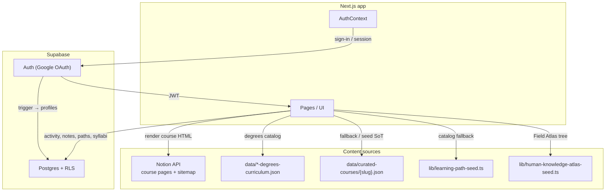
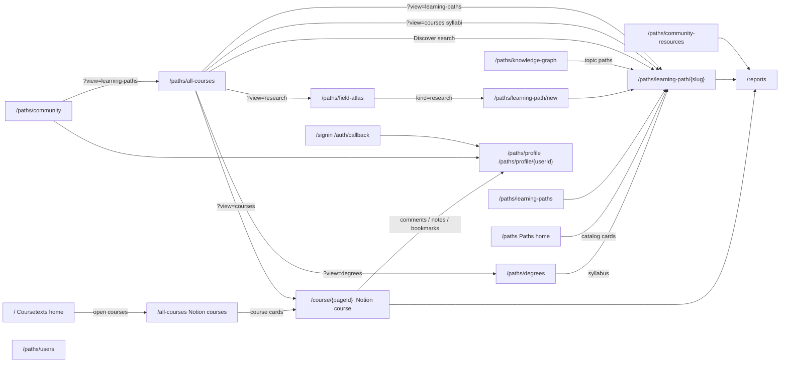
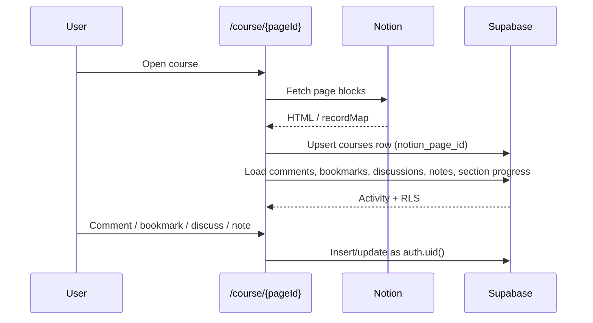
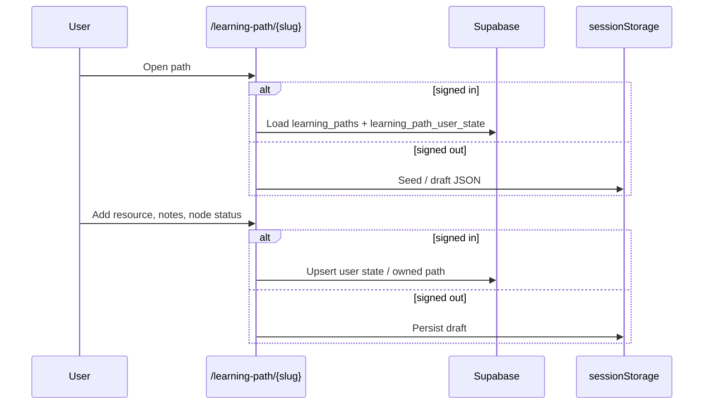

# Architecture

## Big picture

Coursetexts is a Next.js site with **two product surfaces** on one deploy:

1. **Coursetexts** — open library of official Notion university courses at `/`, `/all-courses`, and `/course/{pageId}`
2. **Paths by Coursetexts** — community / research / syllabus learning paths, profiles, degrees, Field Atlas, and knowledge graph, all mounted under `/paths/*`

Canonical Paths URLs live in `lib/paths-routes.ts`. Legacy bare routes (`/learning-path/*`, `/profile`, `/community`, `/degrees`, etc.) **301 redirect** into `/paths/…` via `next.config.js`.

Content pillars under that split:

1. **Official Notion courses** — professor course pages from Notion at `/course/{pageId}`; comments, discussions, bookmarks, and notes in Supabase
2. **Course learning paths** — degree syllabi (topic tree + sequenced resources) stored as `learning_paths` rows with `kind = course` at `/paths/learning-path/{slug}`
3. **Community / research learning paths** — goal-based maps people publish, keep private, or open for collaboration
4. **Community / profiles** — users, follows, resource library, Field Atlas

Everything that is **not** a Notion professor course already lives on `learning_paths` and `/paths/learning-path/{slug}`. Official Notion courses are still a separate CMS. A later pass will migrate those onto `learning_paths` too — that work is not started. See [Future](#future-official-notion-courses).

Signed-out users still see catalog content. Writes (notes, path edits, votes) fall back to `localStorage` / `sessionStorage` until sign-in.

## Coursetexts home (`/`)

Custom landing for the **courses** product (not the Paths home). Section order:

1. Header — brand label **Coursetexts**
2. Dot-grid of featured Notion courses (`HomeDotGrid`, disclaimer hidden; compact top). Furniture sits over a raised class-preview image; the dotted field stops at the furniture shadow so the preview is not clipped.
3. Hero (`CoursesHomeHero`) — “An *open library* of advanced course readings.”, search, subject chips (Science, Math, Sociology, English) with a stacked school-logo row beside them (links into `/all-courses`), I’m Feeling Lucky, university-affiliation disclaimer
4. **Try open courses from top schools.** (`HomeOpenCoursesSection`) — left-aligned title + View All; school filters in a full-width band with **top/bottom dotted borders only** (Stanford / Harvard / Yale / Columbia / Princeton); Notion course card grid → `/all-courses`. On narrow viewports, school chips use short names (e.g. **Stanford**, not **Stanford University**) and sit on one row with tighter side padding. Bottom **View All** is a full-width top/bottom-ruled bar (label left, chevron box right), with the longer university-affiliation disclaimer centered under it.
5. Donate / blog / footer

Course cards come from the Notion sitemap in `getStaticProps`. Subject chips and search navigate to `/all-courses` with `q` / subject filters.

## Paths home (`/paths`)

The Paths landing (hero, “What is a learning path?”, community catalog grid, social learning section) lives at `/paths` (`pages/paths/index.tsx`). Header brand label there is **Paths by Coursetexts**. A thin `PathsHomeBanner` sits under the nav (“Paths is Coursetexts' first experiment…”). The DotGrid shows the university-affiliation disclaimer with extra space below it before the hero copy. Community path cards stay **two columns** on small screens. Under **A community for self-learners.**, a **Learning Paths Tutorial** button (`LearningPathsTutorialButton`) opens an in-page YouTube embed modal (same control as on `/about`).

## Site header (`HomeHeader`)

Shared chrome. Brand and nav switch on `isPathsProductPathname()`:

| Surface | Brand | Home href |
| ------- | ----- | --------- |
| Coursetexts (`/`, `/all-courses`, `/course/…`) | Coursetexts | `/` |
| Paths (`/paths/*`) | Paths by Coursetexts | `/paths` |

On Paths, Explore / Create / Community destinations use `lib/paths-routes.ts` (`/paths/all-courses`, `/paths/learning-path/new`, `/paths/community`, `/paths/profile`, etc.). The **About** nav label links to `/about` (dropdown still lists manifesto / professors / blog / support). Signed-in profile controls show a small blue unread dot when `getUnreadProfileNotificationCount` is &gt; 0 (profile trigger and Notifications dropdown item). The mobile menu shows a single Your Profile link when signed in (no nested profile-tab list).

## Official All Courses (`/all-courses`)

Notion university courses only (`pages/all-courses.tsx` + `AllCoursesOfficial`). Left-aligned hero: title, search, subject chips, a dotted rule, school filters, then the course grid. School filter labels drop **University** on mobile (same short names as the home open-courses band). No Discover / Goal-based / Research catalog filters — those live on the Paths catalog.

## Paths catalog (`/paths/all-courses`)

Former unified Discover catalog (moved from `/all-courses`). Above the Guyot title, **All | Goal-based | Academic | Research** is the visible catalog filter (Degrees via `?view=degrees` / promo only). The title follows the selection: **Discover** (default; omit `view`, or `?view=all`), **Goal-based**, **All University Courses**, **Degree Curricula**, or **Research Questions**. Search sits under the title; subject / topic chips and (on Academic) school logos in a pill sit under search. Search `q` is shared. A query with no type filter searches every catalog together: the most goal-relevant result is the **Best match**, then remaining hits are grouped by type without section headings (related learning paths, university courses, research questions). Degree curricula are not on All. Filled `kind=course` syllabi can appear under related learning paths when they match the goal.

**Discover (default)**

1. With a query: best match, then grouped results across learning paths (community + research + matching syllabi), official Notion courses, and Field Atlas research questions, with no section headings. Degree curricula stay off this view. The bottom always ends with brown promo cards: **Can't find what you're looking for? Create your own path →** beside **Check out our degrees page** (matches and empty search). Create opens the create-path modal.
2. With no query: a short browse of each type (paths, university courses, research), no section headings. Full syllabus grid and degree curricula stay on Academic. The create-path promo sits in the learning-paths grid.

**University Courses view (`?view=courses`)**

1. Official Notion courses (capped at 14 until the user searches or picks subject chips)
2. Filled `kind=course` syllabi: every `data/curated-courses/{slug}.json` with a topic tree, merged with `listCourseLearningPaths()` (`is_filled`). Empty catalog stubs stay out. Teal degrees promo in the top-right of that syllabus grid → `/paths/degrees` (new tab)
3. Degree curricula (UG/grad). This is the only catalog view that lists them besides `?view=degrees`.
4. University-affiliation disclaimer
5. Divider

**Learning-paths view (`?view=learning-paths`)**

Public `community` and `research` rows via `listNonCourseLearningPaths()` — **not** `kind=course`, so the ~1800 empty syllabus stubs never appear. With no query, a **Create your own path →** promo sits in the top-right of that grid. Any search (`q`) — including ones with matches — ends with that same create-path card at the bottom; empty search shows “No existing learning paths matched your search,” a hairline, then the card.

**Degrees / Research views**

`?view=degrees` searches UG/grad curricula. `?view=research` searches Field Atlas research questions (`/paths/field-atlas`). These filters are explicit; Coursetexts homepage search does not set them. A search in either view also ends with the create-path card. University Courses search (`?view=courses&q=`) does too.

## Community (`/paths/community`)

Two explainers, then a single trending list.

1. **Learning paths** — copy plus `CommunitySchema` (goal graph). Each step has **Discussions**.
2. **Community Collab Resources** — copy plus `ResourceVoteSchemaDiagram`: numbered study order (`1 2 3`) is independent of ↑ votes for quality (highest vote is deliberately not on item 1). CTA → `/paths/all-courses?view=learning-paths`.
3. **Top 10 trending learning paths of the week** (`CommunityLearning`) — seeded community paths ranked by circle size (no separate questions / degrees / courses blocks).

## App surfaces

| Surface                    | Route(s)                                                         | Primary data                                                                                                                                                                                                                                                                                                                                                                                                    |
| -------------------------- | ---------------------------------------------------------------- | --------------------------------------------------------------------------------------------------------------------------------------------------------------------------------------------------------------------------------------------------------------------------------------------------------------------------------------------------------------------------------------------------------------- |
| Coursetexts home           | `/`                                                              | Notion sitemap; `CoursesHomeHero` + `HomeOpenCoursesSection`                                                                                                                                                                                                                                                                                                                                                    |
| Official course catalog    | `/all-courses`                                                   | Notion courses only; subject + school filters                                                                                                                                                                                                                                                                                                                                                                   |
| Notion courses             | `/course/{pageId}`                                              | Notion + `courses` / activity / `course_notes`. Shared bottom **StepNavBar**: Previous (hidden on first), **N of M**, **Mark as explored** / **✓ Explored**, **Next →** / **Finish path** on topic sections. On the **General** tab: **Commit & Remind Me** and **Start path** (no Mark as explored). TOC uses the same light-blue stroke check as learning paths when a section is explored. Pin-nav **Continue** uses cached TOC labels, or `POST /api/course-toc` headings when the course has not been opened in this browser. On mobile (≤800px), the TOC is a full-height left drawer opened from **The Course** in the content bar (Discussions / Your Notes row), with a « close control like learning paths. |
| Paths home                 | `/paths`                                                         | Former Paths landing: hero, learning-path explainer, community catalog                                                                                                                                                                                                                                                                                                                                          |
| Paths catalog              | `/paths/all-courses`                                             | Small **All \| Goal-based \| Academic \| Research** filter above the title (Degrees via URL/promo). Omit `view` (or `?view=all`) for unified Discover: **Best match** then groups by type with no section headings and no degree curricula; bottom promos are create-path + degrees side by side. `?view=courses` Academic: official Notion, filled syllabi, then degree curricula. `?view=learning-paths` Goal-based; `?view=research` Research — both end with the create-path card. `?view=degrees` for degree curricula only. |
| Degrees                    | `/paths/degrees`                                                 | UG / grad JSON                                                                                                                                                                                                                                                                                                                                                                                                  |
| Course learning path       | `/paths/learning-path/{slug}` (`kind=course`)                    | Same shell; **Overview** (Resources + Recommended Path) then syllabus tree; **Start learning path** on Overview opens the first topic (or Resources); `learning_paths.data` (`curated_*` backup)                                                                                                                                                                                                                                                                                                                                       |
| Community / research paths | `/paths/learning-paths`, `/paths/learning-path/{slug}`, `/paths/learning-path/new` | `learning_paths` + `learning_path_user_state`. Left outline: **Overview** (Resources only; no Why; **Start learning path** on the step bar), then the accordion topic tree (vertical line for nested steps; light-blue stroke check when explored). Hero: **By {owner}** plus **Collaborators:** (blue names when invited); publisher photo · Public/Open to suggestions/Private · Mon YYYY; Save/••• chip (bookmark icon). **•••** has Share / Report (hidden on your own path) / Delete / visibility (**Private** · **Public** · **Open to suggestions**) / **Invite editors**, with left icons and a staggered open animation. Owners can **Invite editors** by email on any visibility (no email is sent; access is a matching signed-in address; apply `053`). Owners/invitees edit titles and whys inline; **Edit path** inserts an inline blue title field under or after the topic (or deletes); invitee-added resources show **Added by you**. A private URL you cannot read shows a gate; signed-in visitors can **Request to join**. On Collab, visitors suggest resources (dotted card); the owner **Accept**s them onto the official list. **Context** opens a dialog with the copied LLM prompt (current step, numbered outline with whys, goal) and how to paste it into a chat. Auto-fill shows a watering-plant popup until the outline is ready. Below the path, **Discuss this with others?** sits beside **People on this learning path** (invited collaborators first with `(collaborator)`, then public savers; `054`). Topic threads are **Discussions**. On mobile (≤900px), the outline is a left drawer opened from **The Path** in the topic bar. |
| Field Atlas                | `/paths/field-atlas`                                             | Seeded atlas tree (`lib/human-knowledge-atlas-seed.ts`); can start a `kind=research` path |
| Knowledge graph            | `/paths/knowledge-graph`                                         | Frozen snapshot in `data/knowledge-graph.json`. Page does not call `GET /api/knowledge-graph` (that route returns 410). Rebuild snapshot: `npx tsx scripts/snapshot-knowledge-graph.ts`. LLM clustering is typed but not called yet. |
| Community explainer        | `/paths/community`                                               | Learning-path copy + structure diagram; collab-resources copy + vote/order diagram; top 10 trending learning paths of the week                                                                                                                                                                                                                                                                                                              |
| About                      | `/manifesto`, `/about`, `/process`, `/professors`, `/support`    | Header **About** goes to `/about` (dropdown: Why / Professors / Blog / Support). `/about` is a custom landing + inaugural essay (`pages/about.tsx`) with hover glossary definitions (`DefinedTerm` / `GlossaryTerm`, including autodidact); How Does CourseTexts Work includes dark CTAs (catalog → `/`, Learning Paths Tutorial YouTube modal + Explore → `/paths`); manifesto remains the Why page; `/process` remains a Notion override. Blog is `blog.coursetexts.org`.                                                                                                                                                                                                                                    |
| Resource library           | `/paths/community-resources`                                     | `resources`, `knowledge_components`, `search_community`                                                                                                                                                                                                                                                                                                                                                         |
| Reports                    | `/reports`                                                       | `content_reports`. Open while testing; later `coursetexts.info@gmail.com` only.                                                                                                                                                                                                                                                                                                                                 |
| Profile / social           | `/paths/profile`, `/paths/profile/{userId}`, `/paths/users`      | profiles, follows, interests, personal links, owned/saved paths, profile Updates (in Feed). Sidebar: public **bio**; interest chips; **Currently learning** / **Previously learned**. On **your** profile, personal links sit under Previously learned; on **someone else’s**, the links icon sits beside their name. Edit (pencil, own only): bio + learning fields, remove interests, **+ New link** and **Save profile**. Hover Paths cards: own profile shows description + **Continue, Next: {topic}** when available; public profiles show **description only** (no Continue). Public Paths includes a **Committed** filter (read-only badges; needs `052`). Tabs (own): **Paths** → **Topics** → **Notes** → **Resources** → \| → **Feed** → **Notifications**. Public omits Notes and Notifications. **Feed**: author-first posts; Updates are plain text (quoted originals are nested cards); comments/discussions lead with a target card then a spine to the actor. **Repost** / **Quote** on Updates (`051`). **Notifications**: unread count badge left of the tab label; new rows use a faint blue background. Covers followed you, liked / reposted / quoted your update, replied, path invites, resource submit/accept, join requests. |
| Auth                       | `/signin`, `/auth/callback`                                      | Google OAuth. Return to the gated page/section (`sessionStorage` / `localStorage` + `?node=` / `?topic=` / `?notes=1` / `?annotations=1` for Discussions). Callback reads the path once. Fallback `/`, not `/paths/profile`.                                                                                                                                                                                          |

Legacy URLs:

- `/feed.xml` — not a route; RSS is served at `/feed` only
- `/learning-path/*`, `/learning-paths`, `/profile`, `/profile/:userId`, `/community`, `/community-resources`, `/degrees`, `/knowledge-graph`, `/field-atlas`, `/users`, and old Discover query shortcuts → **permanent redirects** into `/paths/…` (see `next.config.js`)

Root Notion site pages (`/process`, `/why`) are served by `[pageId].tsx` via `site.config.ts` overrides. `/about` is a custom page (`pages/about.tsx`). All other bare slugs at the root (e.g. `/some-course-name`) return **404** — use `/course/{slug}` or `/paths/learning-path/{slug}` instead.

## Route catalog

All user-facing pages (excluding `_app`, `_document`, `_error`, and API handlers). For **404 routes, partial features, and orphaned APIs**, see [gaps.md](./gaps.md).

| Route | Status | Rendering | Notes |
| ----- | ------ | --------- | ----- |
| `/` | Live | SSG | Coursetexts courses home; Notion sitemap for course cards |
| `/all-courses` | Live | Client + SSG courses | Official Notion courses only |
| `/paths` | Live | SSG | Paths by Coursetexts landing |
| `/paths/all-courses` | Live | Client + server catalog | Unified Discover search; `?view=` filters |
| `/course/[pageId]` | Live | ISR (Notion) | Official professor courses; `revalidate: 10` |
| `/about` | Live | Static | About landing, product links, inaugural essay, hover term definitions, Learning Paths Tutorial modal |
| `/process`, `/why` | Live | SSR (Notion) | Root Notion overrides via `[pageId].tsx` + `site.config.ts` |
| `/paths/learning-path/[slug]` | Live | Client + Supabase | Community, research, and course-kind paths |
| `/paths/learning-path/new` | Live | Client | Outline builder; `?goal=` / `?kind=research` |
| `/paths/learning-paths` | Live | Client + Supabase | Path catalog |
| `/paths/degrees` | Live | Client | UG + grad JSON curricula |
| `/paths/field-atlas` | Live | Static | Research Field Atlas |
| `/paths/knowledge-graph` | Live | Static | Bundled `data/knowledge-graph.json` snapshot |
| `/paths/community` | Live | Static | Explainers + top 10 trending paths |
| `/paths/community-resources` | Live | Client + Supabase | Site-wide resource library |
| `/paths/profile` | Live | Client + Supabase | Own profile (Notes tab); redirects unsigned users to `/signin` |
| `/paths/profile/[userId]` | Live | Client + Supabase | Public profile view |
| `/paths/users` | Live | Client + Supabase | User directory |
| `/reports` | Live (open) | Client + Supabase | Content reports; public while `REPORTS_DASHBOARD_OPEN` |
| `/manifesto` | Live | Static | Why Coursetexts (header About menu) |
| `/professors` | Live | Static | For professors |
| `/support` | Live | Static | Support / donate CTA |
| `/signin`, `/auth/callback` | Live | Client | Google OAuth; callback restores stored redirect |
| `/privacy-policy`, `/terms-of-service` | Live | Static | Legal (some stale internal links) |
| `/feed` | Live | SSR | Blog RSS XML at `/feed` (not `/feed.xml`) |
| `/sitemap.xml` | Live | SSR | Notion course URLs at `/course/*` |
| `/robots.txt` | Live | SSR | Crawler rules |
| `/404` | Live | Static | Not found |

### API routes

| Route | Method | Status | Role |
| ----- | ------ | ------ | ---- |
| `/api/login` | POST | Live | Preview password gate (iron-session; separate from Supabase) |
| `/api/logout` | POST | Orphaned | Clears preview session; no UI caller |
| `/api/course-toc` | POST | Live | TOC headings for pin-nav Continue on Notion courses |
| `/api/link-preview` | GET | Live | Open Graph unfurl for profile Update URLs (`?url=`) |
| `/api/fill-learning-path` | POST | Live | Auto-fill learning path outline (Gemini; needs `GEMINI_API_KEY`) |
| `/api/search-notion` | POST | Live | Notion in-page search |
| `/api/knowledge-graph/ingest` | POST | Live | Incremental topic/path ingest after finishing a public path |
| `/api/cron/rebuild-knowledge-graph` | GET/POST | Disabled | No-ops unless `KNOWLEDGE_GRAPH_CRON_ENABLED=true`; no Vercel cron |
| `/api/knowledge-graph` | GET | **410** | Disabled; page uses static JSON, not this route |
| `/api/notion-page-info` | POST | Unused | Notion metadata; no client callers |
| `/api/social-image` | GET | Bypassed | Static OG PNG; app uses `/images/og-preview.png` directly |

See [gaps.md](./gaps.md) for the full list of partial product features (reminders, karma, etc.).

## How a Notion course page uses the DB

Notion owns the **reading**. Supabase stores **people activity** keyed by Notion page id (`courses.notion_page_id`).

Comments and bookmarks on **learning paths** and **course learning paths** reuse the same `courses` / `comments` / `bookmarks` tables with synthetic ids:

- `learning-path:{slug}`
- `course-learning-path:{slug}`

## How a community learning path uses the DB

Catalog rows (`is_catalog = true`, `owner_id` null) are public. User-owned rows default to `visibility = private` until the owner publishes (`public`) or opens collaboration (`collaborative`). Private → public/collab requires at least 1 resource and a filled why on every topic; see [learning-paths.md](./learning-paths.md#visibility). `is_private` stays in sync with `visibility = private`. The hero date line shows Public / Open to suggestions / Private · Mon YYYY (no “Published” label); owners change visibility and can delete the path from **•••** (Report is omitted on your own path). Casual visitors cannot add or edit nodes on public or collaborative paths. On any owned path the owner can invite an existing Coursetexts user by email (`learning_path_invites`; apply `053` so this is not private-only); that person can read and co-edit the outline. Invitees’ own official resources show **Added by you**. Owners/authors can **Edit** / **Delete** resources from the edit modal. On a collaborative path, other visitors suggest resources (dotted card); the owner **Accept**s them onto the official list. No invitation email is sent. A signed-in visitor who cannot open a private URL can **Request to join** (`learning_path_join_requests`); the owner sees that email on the path and on `/profile`.

## How a course learning path uses the DB

Degree pages link to `/learning-path/{slug}`. The unified route always renders the `LearningPath` shell. When `kind = course`, that shell uses the course kicker and syllabus outline (**Overview**, then the topic tree); the main pane is still the syllabus topic / video UI. The page loads `learning_paths.data` (syllabus JSON). If that row is missing or has an empty topic tree, the client falls back to `curated_*` tables, then `data/curated-courses/{slug}.json` / `lib/course-learning-path-seed.ts`.

Adding a resource on a syllabus node patches `learning_paths.data` and also publishes a row in site-wide `resources` (for `/community-resources`). Catalog course rows stay writable for signed-in users (same as before). `curated_*` tables are not dropped; they are a backup and the migrate/seed source.

## Paths on a profile

`/paths/profile` **Paths** lists owned, saved, pinned, and official Notion courses. Community/research/course-kind cards show muted byline text under the title: **Created by you · Private** (or Public / Open to suggestions) for paths you made, and **By {name} · Public** for saved paths. Pinned Coursetexts syllabi show **By Coursetexts · Public**. Official Notion courses show **By {professors} · {school} · Public** when the course hero has been opened (professors + school are remembered locally), otherwise **By {school} · Public** or **By Coursetexts · Public**. Action tags stay on the right: Saved, then a muted **% complete** tag when there is progress (hidden at 0%), then **Commit**, then **Notify** on card hover (own profile, committed items only). Frequency uses the site `FormSelect`. Cadence is stored on `learning_path_commitments` (`reminder_frequency`, `reminder_minute`, `reminder_timezone`); sending notifications is not built yet. Own-profile Paths filters are **By you** · **Committed** · **Goals-based** · **Academic** · **Research**. On **someone else’s** profile, Paths filters are **Committed** · **Goals-based** · **Academic** · **Research**; cards show a read-only **Committed** badge when applicable, and hover shows description only (no “Pick up where you left off” / **Continue →**). Public commitment reads need migration `052`. See [learning-paths.md](./learning-paths.md).

## Topics on a profile

Finishing a community, research, or course path records unique topic labels on `user_knowledge_topics` and may ingest structural edges plus path occurrences into the shared catalog. `/paths/knowledge-graph` maps those topics to the learning paths they reoccur in. Newly explored topics (and finishing the whole map) ask for learner-entered duration and a 0–100% enjoyment rating (`learning_path_ratings`). The Topics tab list and the path **What you learned** row are documented in [knowledge.md](./knowledge.md). A daily Gemini job that would add extra catalog edges is **in the repo but not scheduled**. The next LLM step is clustering similar labels across paths.

## Notes on a profile

`/profile` has a **Notes** tab (not shown on `/profile/{userId}`). It lists the signed-in user's private TipTap notes from Notion `course_notes` and from `learning_path_user_state` (plus leftover `curated_course_notes`). Opening a row lets you edit the note in place. **Export PDF** on the notes toolbar downloads the current note as a PDF. **Open** goes to that topic on the course or learning path (`?node=` or `?topic=`) and opens the notes side panel (`?notes=1`).

**Feed** uses pills (**Following** · **Yours**) plus the shared SEARCH field. **You** includes the Updates composer and your posts (likes + threaded replies), then your comments and discussions. Following is followed social activity (including followed Updates). Layout is author-first: avatar + name, with body text indented under the name. Update posts are plain text (no Add tags in the composer) with optional link-preview cards; in-body URLs and other feed links use dark underlines rather than blue; only nested quoted/reposted originals use a quote card. Bookmarks and learning paths stay trailing target cards. Comments and discussions lead with the course/discussion target card, then a spine from the type icon down to the responding avatar(s). **Repost** opens a menu for one-click reshare or **Quote** with commentary. **Notifications** (own profile only; unread badge left of the tab, faint blue on new cards) lists: **followed you**, **liked your update**, **reposted your update**, **quoted your update**, **replied to you**, **invited you to their learning path**, **submitted a resource to your path — review it**, **accepted your resource submission**, plus join requests on your private paths. The **Notifications** tab label shows a light-blue unread count (cleared when you open the tab; uses `profiles.replies_last_read_at`). Opening the tab marks reply notifications read. Join requests also appear as a banner at the top of your profile. Reply unread still drives the header badge.

## Profile Updates

Short posts live on `profile_updates` (migration `050`, repost/quote in `051`) and are composed from the profile **Feed** (not a separate Updates tab). Likes use `votes.target_type = 'profile_update'`; replies use polymorphic `comments` with the same target type. Followed people’s Updates also appear under Following. **Repost** creates an empty new row with `repost_of_id`; **Quote** creates a new row with commentary and `quote_of_id` (both embed the root original). Pasting an `http(s)` URL into an Update stores it on `profile_updates.url` and shows a Twitter/Slack-style unfurl via `GET /api/link-preview` (Open Graph title, description, image, domain) under the post in the composer, Feed, and nested quote/repost embeds.

## Profile sidebar (public)

Edit on `/profile` (pencil): bio, **Currently learning**, **Previously learned**, personal links, and remove existing interest chips (no “+ New interest” in the sidebar). Bio and learning fields live on `profiles` (migration `049`) so they are readable on `/profile/{userId}`. Learning lines are compact metadata (`topic · topic · +N`); click expands. On your own profile, personal links sit under **Previously learned** as a text-style count that opens a popover. On someone else’s profile, the links icon (+ count) sits beside their display name. In edit mode, **+ New link** and **Save profile** share one row. Apply `049_profile_learning_summary.sql` on existing DBs. Profile **Updates** need `050_profile_updates.sql`. Repost/quote need `051_profile_update_reposts.sql`. Public **Committed** on `/profile/{userId}` needs `052_public_learning_path_commitments_read.sql`.

## Reports (`/reports`)

Users can flag **discussions**, **comments**, **learning paths**, and **uploaded resources**. On a learning-path hero, **•••** opens **Report**. Resource rows still expose a flag. Rows land in `content_reports` and show on `/reports`. That dashboard is **open while testing** (`REPORTS_DASHBOARD_OPEN = true` in `lib/content-reports.ts`); flip to `false` to limit access to `coursetexts.info@gmail.com`.

## Not wired yet

Partial UI, disabled cron jobs, orphaned APIs, and URLs that 404 are catalogued in [gaps.md](./gaps.md).

## Key conventions

- **Browser client** uses the anon key + user JWT only (`lib/supabase.ts`). RLS is the ACL.
- **`profiles.user_id`** is the auth uid everywhere (not `profiles.id`).
- **Official Notion courses** use `courses.notion_page_id` (text PK) and stay at `/course/{pageId}` until a future migrate.
- **All non-Notion paths** share `learning_paths.slug`. One `/learning-path/{slug}` shell: `kind` selects the title kicker and left outline (`community` / `research` → goal graph, `course` → syllabus tree).
- **Service role** is for seed scripts and (if re-enabled) the knowledge-graph cron. Never the browser.

## Future: official Notion courses

`027` put degree syllabi on `learning_paths`. **Official Notion courses are next, not now.**

They still render from the Notion API at `/course/{pageId}`. Activity is keyed by the real Notion page id on `courses`. Do not copy those pages onto `learning_paths` in this schema, and do not merge activity prefixes (`learning-path:`, `course-learning-path:`, Notion ids) — that would mix or drop comment threads.

When that migrate happens, the goal is one identity table for every Coursetexts course: community, research, degree syllabus, and professor/Notion courses. Until then, treat Notion as a separate CMS.
