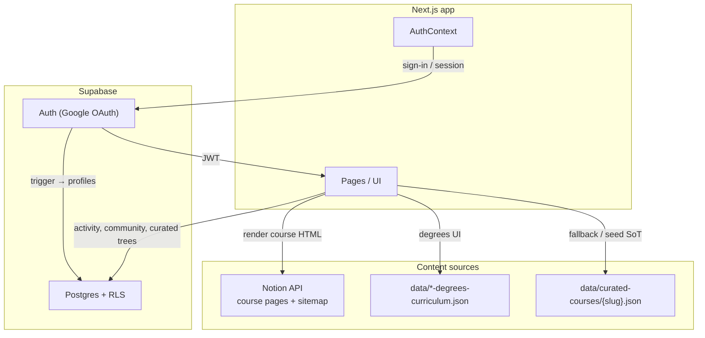
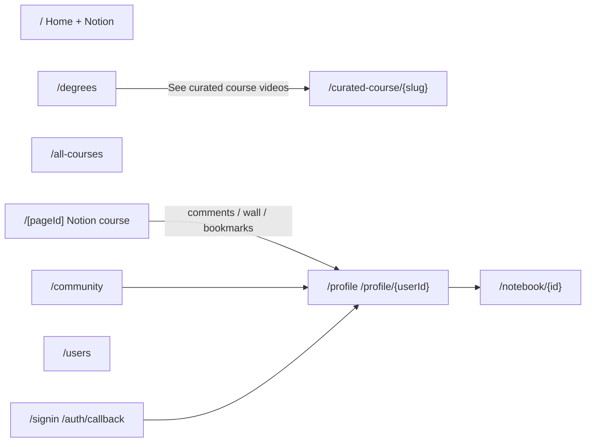
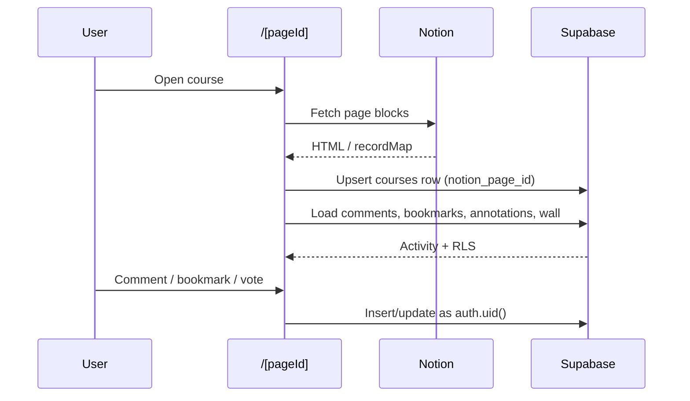

# Architecture

## Big picture

Coursetexts is a Next.js site with three content pillars:

1. **Notion-backed courses** — page content from Notion; social activity in Supabase  
2. **Degrees curricula** — hardcoded JSON outlines + links into curated courses  
3. **Community / profiles** — fully Supabase-backed

## App surfaces

| Surface | Route(s) | Primary data |
|---------|----------|--------------|
| Notion courses | `/`, `/[pageId]`, `/all-courses`, `/c/*` | Notion + Supabase `courses` / activity |
| Degrees | `/degrees` | UG / grad JSON |
| Curated course | `/curated-course/[courseSlug]` | `curated_courses` / `curated_course_*` (+ JSON fallback) |
| Community | `/community` | `resources`, `knowledge_components`, comments/votes |
| Profile / social | `/profile`, `/profile/[userId]`, `/users` | profiles, follows, links, notebooks |
| Auth | `/signin`, `/auth/callback` | Supabase Auth |

## How a Notion course page uses the DB

Notion still owns the **content**. Supabase stores **people activity** keyed by Notion page id.

## Key conventions

- **Browser client** uses the anon key + user JWT only (`lib/supabase.ts`). RLS is the ACL.
- **`profiles.user_id`** is the auth uid everywhere (not `profiles.id`).
- **Notion courses** use `courses.notion_page_id` (text PK).  
- **Curated courses** use `curated_courses.slug`, with `curated_course_nodes`, `curated_course_videos`, `curated_course_resources`, `curated_course_notes`.
- **Service role** is for seed scripts only, never the browser.
