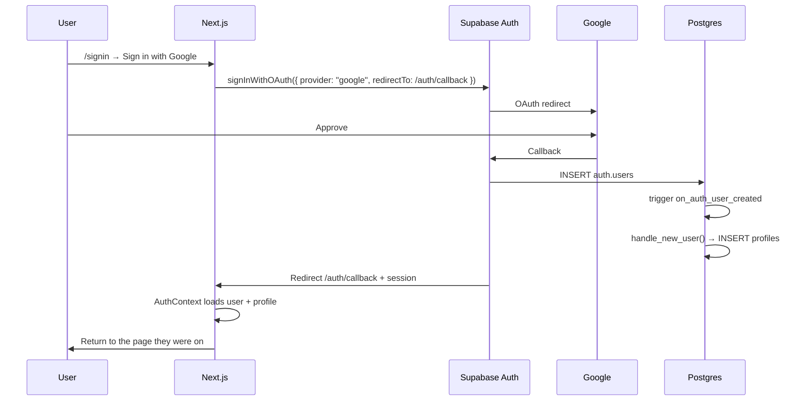
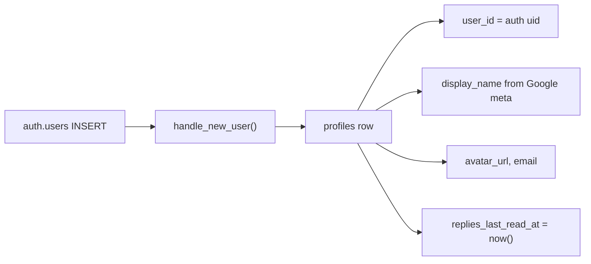

# Auth

## Google sign-in

Before OAuth, `signInWithGoogle(next)` stores a same-origin path in `sessionStorage` and `localStorage` (`coursetexts.authRedirect`). `/auth/callback` reads it **once** and `router.replace`s there. If nothing was stored, the fallback is `/`, not `/profile`. The callback used to re-run when the Next.js router object changed and wipe the stored path, which sent people home.

Return path rules (`lib/auth-redirect.ts`):

- Must start with `/` (no `//`, no `://`)
- `/signin` and `/auth/*` are rejected
- Default is the current `pathname + search + hash`
- Gates can add query flags so the same section reopens: `node`, `topic`, `notes=1`, `annotations=1` (Discussions panel; `discussions=1` also works)
- Header **Sign in** uses `?redirect=` of the current `asPath`
- The home **Create an Account** CTA still goes to `/profile` on purpose

The new-path builder also writes the outline to `sessionStorage` / `localStorage` (`coursetexts.learning-path-builder-draft`) before Google, then restores it on `/learning-path/new`.

## Profile creation

App code always joins social data with **`profiles.user_id`**, not `profiles.id`.

## What requires sign-in

Public without an account: home, official Notion courses (`/course/{pageId}`), degrees, catalog learning paths, course learning paths, Field Atlas, community pages.

Needs a session (or local-only until sign-in):

| Action                            | Signed in                                                     | Signed out                               |
| --------------------------------- | ------------------------------------------------------------- | ---------------------------------------- |
| Comments, votes, discussions      | Supabase (`annotations` table)                                | disabled                                 |
| Course / path notes               | `course_notes` / `learning_path_user_state`                   | `localStorage`                           |
| Create / edit own learning path   | `learning_paths`                                              | `sessionStorage` / `localStorage` drafts |
| Save someone else’s path          | `user_links` row pointing at `/learning-path/{slug}`          | n/a                                      |
| Bookmark a learning-path resource | `user_links` (resource URL or path + `node`/`resource` query) | n/a                                      |
| Pin a course learning path        | `learning_path_pins`                                          | n/a                                      |
| Upvote a learning-path resource   | `learning_path_resource_votes` (does not change list order)   | click → sign in                          |
| Notebooks, follows, profile       | Supabase                                                      | n/a                                      |

## Dashboard setup (new project)

1. Enable **Google** provider (Client ID / Secret).
2. Under **URL configuration**, keep **Site URL** as the live app (`https://coursetexts.org` or preview). Then add **every** return URL you actually use under **Redirect URLs**. If localhost is missing, Google sign-in from `yarn dev` sends you to the Site URL instead.

   Allow at least:

   - `http://localhost:3000/auth/callback`
   - `http://127.0.0.1:3000/auth/callback`
   - `https://coursetexts.org/auth/callback`
   - `https://preview.coursetexts.org/auth/callback`

   The app always sets `redirectTo` to `{window.location.origin}/auth/callback`, so local tabs stay on localhost and deployed tabs stay on that host.

3. Google OAuth redirect: `https://<project-ref>.supabase.co/auth/v1/callback`.
4. Env: `NEXT_PUBLIC_SUPABASE_URL`, `NEXT_PUBLIC_SUPABASE_ANON_KEY`.

## Other auth

- **Preview password** (`/api/login` iron-session) is separate from Supabase — not a DB user.
- Seeds may create email users with the **service role** key (scripts only).
