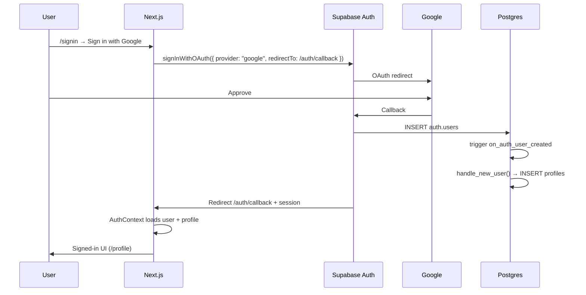
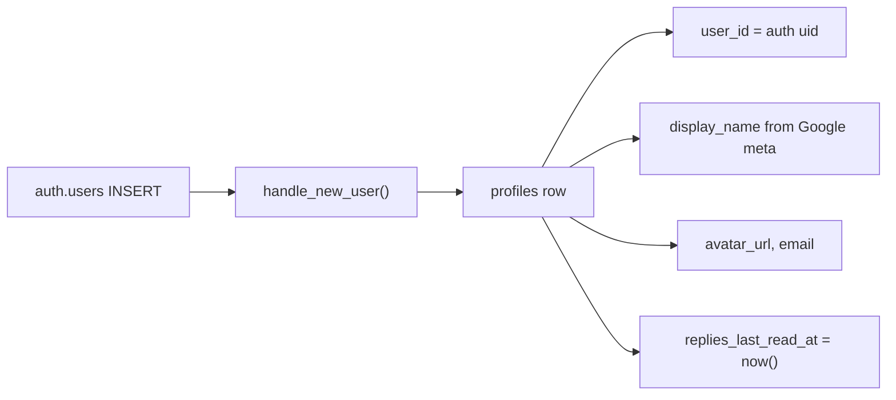

# Auth

## Google sign-in

## Profile creation

App code always joins social data with **`profiles.user_id`**, not `profiles.id`.

## Dashboard setup (new project)

1. Enable **Google** provider (Client ID / Secret).  
2. Site URL + redirect allowlist include `{origin}/auth/callback`.  
3. Google OAuth redirect: `https://<project-ref>.supabase.co/auth/v1/callback`.  
4. Env: `NEXT_PUBLIC_SUPABASE_URL`, `NEXT_PUBLIC_SUPABASE_ANON_KEY`.

## Other auth

- **Preview password** (`/api/login` iron-session) is separate from Supabase — not a DB user.
- Seeds may create email users with the **service role** key (scripts only).
