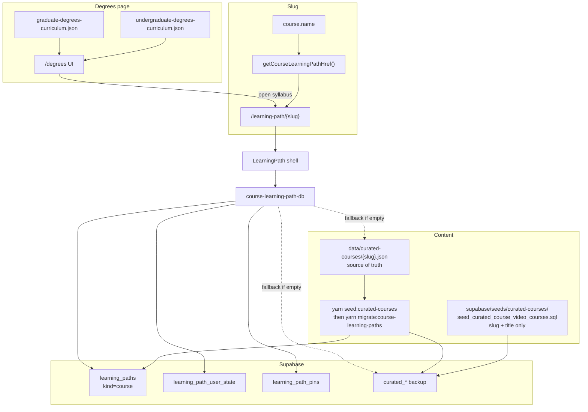
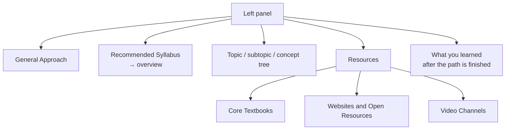

# Course learning paths (curated syllabi)

Degree syllabi with a topic tree and sequenced resources. They live on the same `learning_paths` table as community/research paths (`kind = course`) and share `/learning-path/{slug}`. See [learning-paths.md](./learning-paths.md) for the graph UI.

**Official Notion courses stay on `/course/{pageId}`.** They are not `kind = course` rows. A later pass will migrate those professor courses onto `learning_paths` too so every Coursetexts course is a learning path. That work is not started — see [architecture — Future](./architecture.md#future-official-notion-courses).

**Canonical route:** `/learning-path/{slug}`  
**Legacy:** `/course-learning-path/{slug}` and `/curated-course/{slug}` redirect here. `/course-videos?slug=` client-redirects to the same URL.

Migrated rows: `kind = 'course'`, `visibility = 'public'`, `is_catalog = true`, `owner_id = null`. `curated_*` tables are **not dropped**; they remain a backup. The app reads/writes `learning_paths.data` after cutover.

## End-to-end flow



## Tables (live vs backup)

| Table | Role after unify |
|-------|------------------|
| `learning_paths` (`kind=course`) | Identity + syllabus JSON (`data`) |
| `learning_path_user_state` | Per-user TipTap notes keyed by node id |
| `learning_path_pins` | Per-user pinned syllabi (header dropdown) |
| `curated_courses` / `curated_course_*` | Backup + migrate/seed source; app does not write these after cutover |

Resources added on a syllabus node also appear in `/community-resources`. They are labeled with a plain-text **concept tree** such as `Linear Algebra --> Linear Systems and Elimination --> Gaussian elimination and row reduction`.

Comments/bookmarks on the page keep `courses.notion_page_id = 'course-learning-path:{slug}'` so existing threads stay attached.

Empty catalog placeholders (~1800 slug+title rows) become `kind=course` catalog paths with empty `topics` and `is_filled = false`. Home does **not** list them. The **courses** view of `/all-courses` (default; not `?view=learning-paths`) lists official Notion courses, then (below a divider) filled syllabi: every `data/curated-courses/{slug}.json` that has a topic tree, plus any extra `learning_paths` rows with `is_filled`. A brown promo in that syllabus grid links to `/degrees`. A trigger keeps `is_filled` in sync when `data` changes. Existing DBs: apply `029_learning_path_is_filled.sql`. The **All Learning Paths** title toggle does **not** list these syllabi (see [learning-paths.md](./learning-paths.md)). The profile Learning tab **Courses** filter uses the same split: official Notion bookmarks plus `kind=course` paths. Finishing every syllabus topic records Knowledge labels, shows the completion modal, and adds **What you learned** under Resources in the left nav. See [knowledge.md](./knowledge.md).

Subject icons on those cards reuse the degrees-page SVG set (`DegreeCardIcon`). Area is **not** a Supabase column: optional JSON `"area": "mathematics"` (a degree id) overrides slug-based keywords. The Coursetexts book mark stays on the card; the colored icon is the subject.

## Left-nav page sections



- **General Approach** — graph of the syllabus (`data.mentalMapNodeId` holds map-only clips). Resources only; no **Why is this on the learning path** (the course blurb stays in the hero).
- **Recommended Syllabus** — course blurb + topic list; does **not** wrap the tree.
- **Topic tree** — loads that node’s sequenced resources from `learning_paths.data`. **Why is this on the learning path** and **Resources** start open.
- **Resources** — from `data.resources` (or degrees JSON fallback).
- **What you learned** — appears only after every syllabus node is explored.
- **Ratings** — marking a topic explored asks how long it took and a % for how enjoyable learning that module was using the given resources; finishing the course asks the same for the whole course.

Notes open from the content bar (side panel), not an in-page dropdown. **Export PDF** on the notes toolbar downloads the current note as a PDF.

## JSON shape

See [`data/curated-courses/README.md`](../data/curated-courses/README.md).

```text
{slug}.json
  slug, title, description
  resources[]     kind: textbook | website | youtube
  topics[]        type: topic → subtopic → concept
    videos[]      ordered clips (seeded into videos, then node_resources)
```

## Filling another course

1. Add `data/curated-courses/{slug}.json` (copy Fluid Mechanics).
2. Ensure a catalog row exists in `curated_courses` (degrees catalog seed covers most names).
3. Load the tree:
   - **SQL Editor:** `supabase/seeds/curated-courses/seed_fluid_mechanics_curated_course.sql` is the template, or
   - `yarn seed:curated-courses -- --slug={slug}` (writes `curated_*` then upserts `learning_paths`).
4. Open `/learning-path/{slug}`.

## SQL seeds folder

All curated-course SQL seeds live in [`supabase/seeds/curated-courses/`](../supabase/seeds/curated-courses/).

| File | Contents |
|------|----------|
| `seed_curated_course_video_courses.sql` | Catalog rows (slug + title) for degrees courses |
| `seed_fluid_mechanics_curated_course.sql` | Full Fluid Mechanics tree + videos + resources (self-contained schema repair) |
| `seed_deep_learning_curated_course.sql` | Deep Learning syllabus tree |
| `seed_data_structures_curated_course.sql` | Data Structures syllabus tree |
| `seed_algorithms_curated_course.sql` | Algorithms syllabus tree |
| `seed_database_systems_curated_course.sql` | Database Systems syllabus tree |
| `seed_operating_systems_curated_course.sql` | Operating Systems syllabus tree |
| `seed_computer_networks_curated_course.sql` | Computer Networks syllabus tree + resources |
| `seed_programming_languages_curated_course.sql` | Programming Languages syllabus tree |
| `seed_computer_organization_architecture_curated_course.sql` | Computer Organization/Architecture syllabus tree |
| `seed_computer_organization_and_architecture_curated_course.sql` | Computer Organization and Architecture syllabus tree |
| `seed_linear_algebra_curated_course.sql` | Linear Algebra syllabus tree |
| `seed_calculus_i_curated_course.sql` | Calculus I syllabus tree + resources |
| `seed_calculus_ii_curated_course.sql` | Calculus II syllabus tree + resources |
| `seed_calculus_iii_multivariable_curated_course.sql` | Calculus III (Multivariable) syllabus tree + resources |
| `seed_differential_equations_curated_course.sql` | Differential Equations syllabus tree + resources |
| `seed_financial_accounting_curated_course.sql` | Financial Accounting syllabus tree + resources |
| `seed_business_statistics_curated_course.sql` | Business Statistics syllabus tree + resources |
| `seed_corporate_finance_curated_course.sql` | Corporate Finance syllabus tree + resources |
| `seed_microeconomics_curated_course.sql` | Microeconomics syllabus tree + resources |
| `seed_anatomy_and_physiology_i_curated_course.sql` | Anatomy and Physiology I syllabus tree |
| `seed_probability_and_statistics_curated_course.sql` | Probability and Statistics syllabus tree |
| `seed_computer_systems_systems_programming_curated_course.sql` | Computer Systems / Systems Programming syllabus tree |
| `seed_introduction_to_programming_curated_course.sql` | Introduction to Programming syllabus tree |
| `seed_theory_of_computation_curated_course.sql` | Theory of Computation syllabus tree |
| `seed_compilers_curated_course.sql` | Compilers syllabus tree |
| `seed_artificial_intelligence_machine_learning_curated_course.sql` | Artificial Intelligence / Machine Learning syllabus tree |
| `seed_introductory_physics_i_mechanics_curated_course.sql` | Introductory Physics I (Mechanics) syllabus tree |
| `seed_introductory_physics_ii_eandm_curated_course.sql` | Introductory Physics II (E&M) syllabus tree |
| `seed_modern_physics_curated_course.sql` | Modern Physics syllabus tree |
| `seed_mathematical_methods_for_physics_curated_course.sql` | Mathematical Methods for Physics syllabus tree |
| `seed_classical_mechanics_curated_course.sql` | Classical Mechanics syllabus tree |
| `seed_electromagnetism_electrodynamics_curated_course.sql` | Electromagnetism / Electrodynamics syllabus tree |
| `seed_quantum_mechanics_i_curated_course.sql` | Quantum Mechanics I syllabus tree |
| `seed_thermodynamics_and_statistical_mechanics_curated_course.sql` | Thermodynamics and Statistical Mechanics syllabus tree |
| `seed_quantum_mechanics_ii_curated_course.sql` | Quantum Mechanics II syllabus tree |
| `seed_optics_curated_course.sql` | Optics syllabus tree |
| `seed_solid_state_condensed_matter_physics_curated_course.sql` | Solid State / Condensed Matter Physics syllabus tree |
| `seed_introduction_to_proofs_foundations_curated_course.sql` | Introduction to Proofs / Foundations syllabus tree |
| `seed_probability_theory_curated_course.sql` | Probability Theory syllabus tree |
| `seed_abstract_algebra_curated_course.sql` | Abstract Algebra syllabus tree |
| `seed_real_analysis_curated_course.sql` | Real Analysis syllabus tree |
| `seed_differential_geometry_curated_course.sql` | Differential Geometry syllabus tree |
| `seed_number_theory_curated_course.sql` | Number Theory syllabus tree |
| `seed_mathematical_statistics_curated_course.sql` | Mathematical Statistics syllabus tree |
| `seed_numerical_analysis_curated_course.sql` | Numerical Analysis syllabus tree |
| `seed_complex_analysis_curated_course.sql` | Complex Analysis syllabus tree |
| `seed_topology_curated_course.sql` | Topology syllabus tree |
| `seed_organic_chemistry_i_curated_course.sql` | Organic Chemistry I syllabus tree |
| `seed_organic_chemistry_ii_curated_course.sql` | Organic Chemistry II syllabus tree |
| `seed_analytical_chemistry_curated_course.sql` | Analytical Chemistry syllabus tree |
| `seed_physical_chemistry_i_thermodynamics_and_statistical_mechanics_curated_course.sql` | Physical Chemistry I (Thermodynamics & Statistical Mechanics) syllabus tree |
| `seed_physical_chemistry_ii_quantum_mechanics_and_spectroscopy_curated_course.sql` | Physical Chemistry II (Quantum Mechanics & Spectroscopy) syllabus tree |
| `seed_inorganic_chemistry_curated_course.sql` | Inorganic Chemistry syllabus tree |
| `seed_instrumental_analysis_curated_course.sql` | Instrumental Analysis syllabus tree |
| `seed_biochemistry_curated_course.sql` | Biochemistry syllabus tree + resources |
| `seed_dynamics_curated_course.sql` | Dynamics syllabus tree + resources |
| `seed_statics_curated_course.sql` | Statics syllabus tree + resources |
| `seed_general_biology_i_curated_course.sql` | General Biology I syllabus tree |
| `seed_general_biology_ii_curated_course.sql` | General Biology II syllabus tree |
| `seed_general_biology_i_and_ii_curated_course.sql` | General Biology I & II syllabus tree |
| `seed_general_biology_curated_course.sql` | General Biology syllabus tree |
| `seed_introduction_to_biomedical_engineering_curated_course.sql` | Introduction to Biomedical Engineering syllabus tree |
| `seed_physics_i_curated_course.sql` | Physics I syllabus tree |
| `seed_physics_i_mechanics_curated_course.sql` | Physics I (Mechanics) syllabus tree + resources |
| `seed_physics_ii_curated_course.sql` | Physics II syllabus tree |
| `seed_physics_ii_eandm_curated_course.sql` | Physics II (E&M) syllabus tree + resources |
| `seed_genetics_curated_course.sql` | Genetics syllabus tree |
| `seed_cell_and_molecular_biology_curated_course.sql` | Cell and Molecular Biology syllabus tree |
| `seed_ecology_curated_course.sql` | Ecology syllabus tree |
| `seed_evolutionary_biology_curated_course.sql` | Evolutionary Biology syllabus tree |
| `seed_microbiology_curated_course.sql` | Microbiology syllabus tree |
| `seed_physiology_anatomy_and_physiology_curated_course.sql` | Physiology / Anatomy and Physiology syllabus tree |
| `seed_biostatistics_curated_course.sql` | Biostatistics syllabus tree + resources |
| `seed_statistics_biostatistics_curated_course.sql` | Statistics / Biostatistics syllabus tree |
| `seed_general_chemistry_curated_course.sql` | General Chemistry syllabus tree |
| `seed_general_chemistry_i_and_ii_curated_course.sql` | General Chemistry I & II syllabus tree + resources |
| `seed_programming_for_engineers_matlab_curated_course.sql` | Programming for Engineers (MATLAB) syllabus tree |
| `seed_programming_for_engineers_matlab_python_curated_course.sql` | Programming for Engineers (MATLAB/Python) syllabus tree |
| `seed_materials_science_curated_course.sql` | Materials Science syllabus tree |
| `seed_materials_science_for_engineers_curated_course.sql` | Materials Science for Engineers syllabus tree |
| `seed_numerical_methods_computation_for_engineers_curated_course.sql` | Numerical Methods / Computation for Engineers syllabus tree |
| `seed_mechanics_of_materials_curated_course.sql` | Mechanics of Materials syllabus tree |
| `seed_thermodynamics_curated_course.sql` | Thermodynamics syllabus tree |
| `seed_heat_transfer_curated_course.sql` | Heat Transfer syllabus tree |
| `seed_machine_design_curated_course.sql` | Machine Design syllabus tree |
| `seed_manufacturing_processes_curated_course.sql` | Manufacturing Processes syllabus tree |
| `seed_mechanical_vibrations_curated_course.sql` | Mechanical Vibrations syllabus tree |
| `seed_control_systems_curated_course.sql` | Control Systems syllabus tree + resources |
| `seed_control_systems_system_dynamics_curated_course.sql` | Control Systems / System Dynamics syllabus tree |
| `seed_system_dynamics_and_controls_curated_course.sql` | System Dynamics and Controls syllabus tree |
| `seed_probability_and_random_processes_curated_course.sql` | Probability and Random Processes syllabus tree |
| `seed_circuits_i_curated_course.sql` | Circuits I syllabus tree |
| `seed_circuits_ii_curated_course.sql` | Circuits II syllabus tree |
| `seed_circuits_curated_course.sql` | Circuits syllabus tree |
| `seed_circuits_electrical_engineering_fundamentals_curated_course.sql` | Circuits / Electrical Engineering Fundamentals syllabus tree |
| `seed_digital_logic_design_curated_course.sql` | Digital Logic Design syllabus tree |
| `seed_electronics_curated_course.sql` | Electronics syllabus tree |
| `seed_signals_and_systems_curated_course.sql` | Signals and Systems syllabus tree |
| `seed_microprocessors_embedded_systems_curated_course.sql` | Microprocessors / Embedded Systems syllabus tree |
| `seed_microprocessors_and_embedded_systems_curated_course.sql` | Microprocessors and Embedded Systems syllabus tree |
| `seed_vlsi_digital_system_design_curated_course.sql` | VLSI / Digital System Design syllabus tree |
| `seed_electromagnetics_curated_course.sql` | Electromagnetics syllabus tree |
| `seed_communication_systems_curated_course.sql` | Communication Systems syllabus tree |
| `seed_power_systems_power_electronics_curated_course.sql` | Power Systems / Power Electronics syllabus tree |
| `seed_probability_and_statistics_for_engineers_curated_course.sql` | Probability and Statistics for Engineers syllabus tree |
| `seed_engineering_probability_and_statistics_curated_course.sql` | Engineering Probability and Statistics syllabus tree |
| `seed_surveying_curated_course.sql` | Surveying syllabus tree |
| `seed_hydrology_and_water_resources_curated_course.sql` | Hydrology and Water Resources syllabus tree |
| `seed_hydrology_water_resources_curated_course.sql` | Hydrology / Water Resources syllabus tree |
| `seed_structural_analysis_curated_course.sql` | Structural Analysis syllabus tree |
| `seed_geotechnical_engineering_soil_mechanics_curated_course.sql` | Geotechnical Engineering / Soil Mechanics syllabus tree |
| `seed_transportation_engineering_curated_course.sql` | Transportation Engineering syllabus tree |
| `seed_environmental_engineering_curated_course.sql` | Environmental Engineering syllabus tree |
| `seed_reinforced_concrete_design_curated_course.sql` | Reinforced Concrete Design syllabus tree |
| `seed_steel_design_curated_course.sql` | Steel Design syllabus tree |
| `seed_construction_materials_and_methods_curated_course.sql` | Construction Materials and Methods syllabus tree |
| `seed_material_and_energy_balances_curated_course.sql` | Material and Energy Balances syllabus tree |
| `seed_organic_chemistry_i_and_ii_curated_course.sql` | Organic Chemistry I & II syllabus tree |
| `seed_organic_chemistry_curated_course.sql` | Organic Chemistry syllabus tree |
| `seed_anatomy_and_physiology_curated_course.sql` | Anatomy and Physiology syllabus tree |
| `seed_biomechanics_curated_course.sql` | Biomechanics syllabus tree |
| `seed_biomaterials_curated_course.sql` | Biomaterials syllabus tree |
| `seed_biomedical_instrumentation_curated_course.sql` | Biomedical Instrumentation syllabus tree |
| `seed_biomedical_signals_and_systems_curated_course.sql` | Biomedical Signals and Systems syllabus tree |
| `seed_biotransport_fluid_mechanics_curated_course.sql` | Biotransport / Fluid Mechanics syllabus tree |
| `seed_tissue_engineering_curated_course.sql` | Tissue Engineering syllabus tree |
| `seed_programming_i_curated_course.sql` | Programming I syllabus tree |
| `seed_programming_ii_object_oriented_programming_curated_course.sql` | Programming II / Object-Oriented Programming syllabus tree |
| `seed_database_management_systems_curated_course.sql` | Database Management Systems syllabus tree |
| `seed_networking_fundamentals_curated_course.sql` | Networking Fundamentals syllabus tree |
| `seed_web_development_curated_course.sql` | Web Development syllabus tree |
| `seed_cybersecurity_fundamentals_curated_course.sql` | Cybersecurity Fundamentals syllabus tree |
| `seed_systems_analysis_and_design_curated_course.sql` | Systems Analysis and Design syllabus tree |
| `seed_it_project_management_curated_course.sql` | IT Project Management syllabus tree |
| `seed_cloud_computing_curated_course.sql` | Cloud Computing syllabus tree |
| `seed_data_analytics_business_intelligence_curated_course.sql` | Data Analytics / Business Intelligence syllabus tree |
| `seed_enterprise_architecture_curated_course.sql` | Enterprise Architecture syllabus tree |
| `seed_it_ethics_and_professionalism_curated_course.sql` | IT Ethics and Professionalism syllabus tree |
| `seed_introduction_to_environmental_science_curated_course.sql` | Introduction to Environmental Science syllabus tree |
| `seed_earth_systems_physical_geology_curated_course.sql` | Earth Systems / Physical Geology syllabus tree |
| `seed_environmental_chemistry_curated_course.sql` | Environmental Chemistry syllabus tree |
| `seed_soil_science_curated_course.sql` | Soil Science syllabus tree |
| `seed_climatology_atmospheric_science_curated_course.sql` | Climatology / Atmospheric Science syllabus tree |
| `seed_gis_and_remote_sensing_curated_course.sql` | GIS and Remote Sensing syllabus tree |
| `seed_environmental_policy_and_law_curated_course.sql` | Environmental Policy and Law syllabus tree |
| `seed_environmental_sampling_and_analysis_curated_course.sql` | Environmental Sampling and Analysis syllabus tree |
| `seed_conservation_biology_curated_course.sql` | Conservation Biology syllabus tree |
| `seed_environmental_impact_assessment_curated_course.sql` | Environmental Impact Assessment syllabus tree |
| `seed_discrete_mathematics_curated_course.sql` | Discrete Mathematics syllabus tree + resources |
| `seed_discrete_math_math_for_computing_curated_course.sql` | Discrete Math / Math for Computing syllabus tree |
| `seed_chemical_engineering_thermodynamics_curated_course.sql` | Chemical Engineering Thermodynamics syllabus tree |
| `seed_fluid_mechanics_transport_phenomena_i_curated_course.sql` | Fluid Mechanics / Transport Phenomena I syllabus tree |
| `seed_heat_and_mass_transfer_curated_course.sql` | Heat and Mass Transfer syllabus tree |
| `seed_separation_processes_curated_course.sql` | Separation Processes syllabus tree |
| `seed_chemical_reaction_engineering_curated_course.sql` | Chemical Reaction Engineering syllabus tree |
| `seed_process_control_and_dynamics_curated_course.sql` | Process Control and Dynamics syllabus tree |
| `seed_process_design_and_economics_curated_course.sql` | Process Design and Economics syllabus tree |
| `seed_introduction_to_aerospace_engineering_curated_course.sql` | Introduction to Aerospace Engineering syllabus tree |
| `seed_aerodynamics_fluid_mechanics_curated_course.sql` | Aerodynamics / Fluid Mechanics syllabus tree |
| `seed_aerospace_structures_curated_course.sql` | Aerospace Structures syllabus tree |
| `seed_flight_mechanics_and_performance_curated_course.sql` | Flight Mechanics and Performance syllabus tree |
| `seed_propulsion_curated_course.sql` | Propulsion syllabus tree |
| `seed_stability_and_control_curated_course.sql` | Stability and Control syllabus tree |
| `seed_orbital_mechanics_astronautics_curated_course.sql` | Orbital Mechanics / Astronautics syllabus tree |
| `seed_introduction_to_industrial_engineering_curated_course.sql` | Introduction to Industrial Engineering syllabus tree |
| `seed_engineering_graphics_cad_curated_course.sql` | Engineering Graphics/CAD syllabus tree |
| `seed_engineering_economics_curated_course.sql` | Engineering Economics syllabus tree |
| `seed_operations_research_i_optimization_curated_course.sql` | Operations Research I (Optimization) syllabus tree |
| `seed_operations_research_ii_stochastic_curated_course.sql` | Operations Research II (Stochastic) syllabus tree |
| `seed_work_design_and_human_factors_curated_course.sql` | Work Design and Human Factors syllabus tree |
| `seed_quality_control_and_six_sigma_curated_course.sql` | Quality Control and Six Sigma syllabus tree |
| `seed_production_planning_and_control_curated_course.sql` | Production Planning and Control syllabus tree |
| `seed_supply_chain_and_logistics_curated_course.sql` | Supply Chain and Logistics syllabus tree |
| `seed_simulation_modeling_curated_course.sql` | Simulation Modeling syllabus tree |
| `seed_facilities_planning_and_design_curated_course.sql` | Facilities Planning and Design syllabus tree |

## Fluid Mechanics (reference)

| Piece | Location |
|-------|----------|
| JSON SoT | `data/curated-courses/fluid-mechanics.json` |
| SQL seed | `supabase/seeds/curated-courses/seed_fluid_mechanics_curated_course.sql` |
| Route | `/learning-path/fluid-mechanics` |
| Degrees link | Engineering degrees → Fluid Mechanics |

The Fluid Mechanics SQL seed is **self-contained**: it renames legacy `course_video_*` tables if needed, repairs bad names like `curated_courses_course`, ensures schema, then upserts the full tree.
