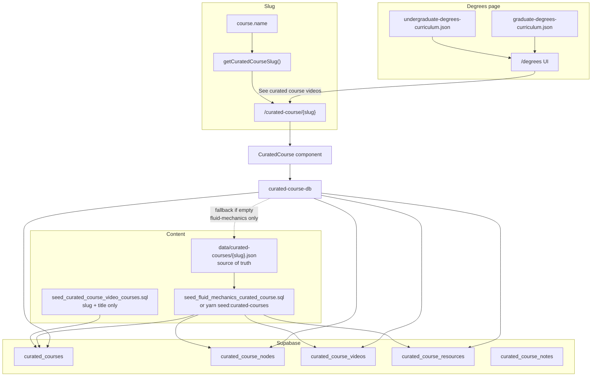
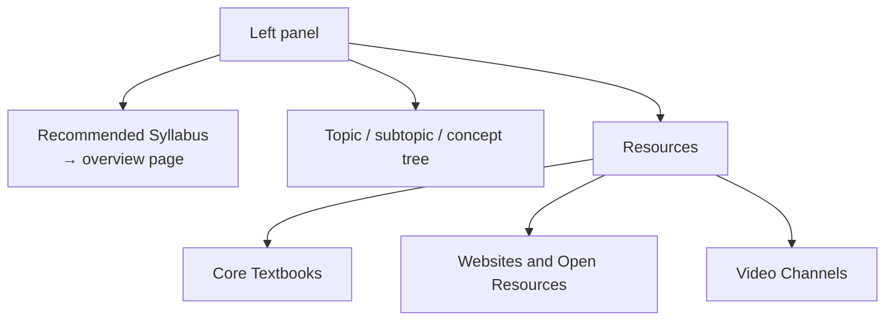

# Curated courses

Curated courses are **not** Notion pages. They are syllabus + video libraries linked from the Degrees page.

## End-to-end flow



## Tables

| Table | Purpose |
|-------|---------|
| `curated_courses` | One row per slug |
| `curated_course_nodes` | Syllabus tree |
| `curated_course_videos` | Videos on a node |
| `curated_course_resources` | Textbooks / websites / channels |
| `curated_course_notes` | Per-user notes |

## Left-nav page sections



- **Recommended Syllabus** — selectable section (course blurb + topic list); does **not** wrap the tree.  
- **Topic tree** — loads curated videos in the main panel.  
- **Resources** — from `curated_course_resources` (or degrees JSON fallback).

## JSON shape

See [`data/curated-courses/README.md`](../data/curated-courses/README.md).

```text
{slug}.json
  slug, title, description
  resources[]     kind: textbook | website | youtube
  topics[]        type: topic → subtopic → concept
    videos[]      ordered curated clips per node
```

## Filling another course

1. Add `data/curated-courses/{slug}.json` (copy Fluid Mechanics).  
2. Ensure catalog row exists (`curated_courses` — degrees catalog seed covers most names).  
3. Load tree:
   - **SQL Editor:** `seed_fluid_mechanics_curated_course.sql` is the template (self-contained: rename/fix/create + data), or  
   - `yarn seed:curated-courses -- --slug={slug}` (needs service role).  
4. Open `/curated-course/{slug}`.

## Fluid Mechanics (reference)

| Piece | Location |
|-------|----------|
| JSON SoT | `data/curated-courses/fluid-mechanics.json` |
| SQL seed | `supabase/migrations/new/seed_fluid_mechanics_curated_course.sql` |
| Route | `/curated-course/fluid-mechanics` |
| Degrees link | Engineering degrees → Fluid Mechanics → “See curated course videos” |

The Fluid Mechanics SQL seed is **self-contained**: it renames legacy `course_video_*` tables if needed, repairs bad names like `curated_courses_course`, ensures schema, then upserts the full tree.
