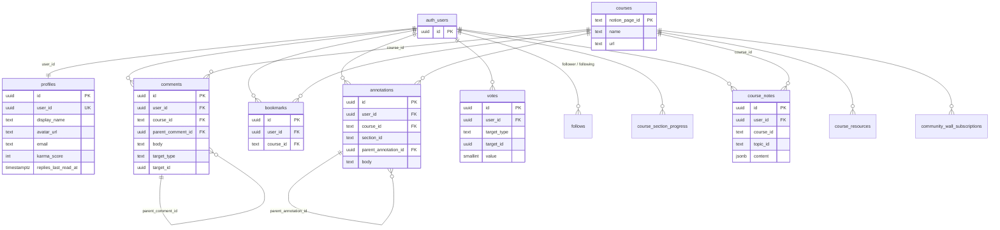
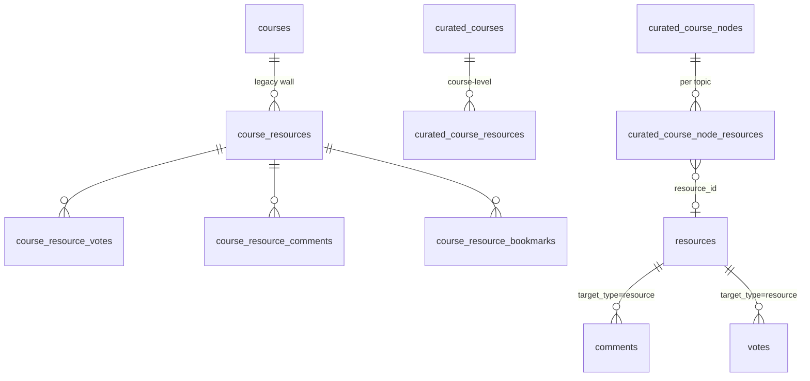
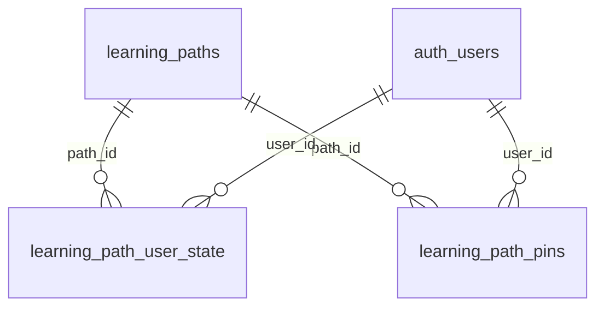
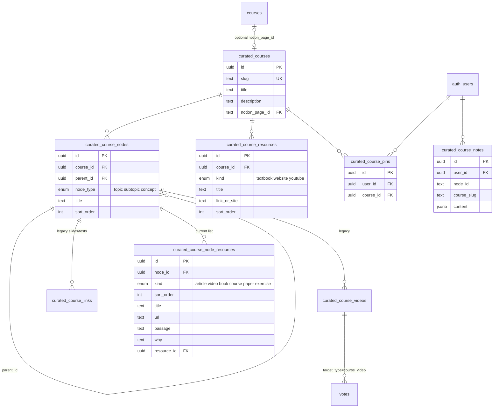
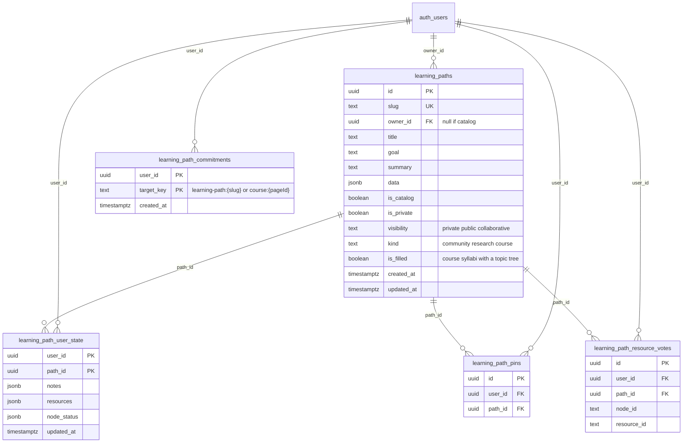
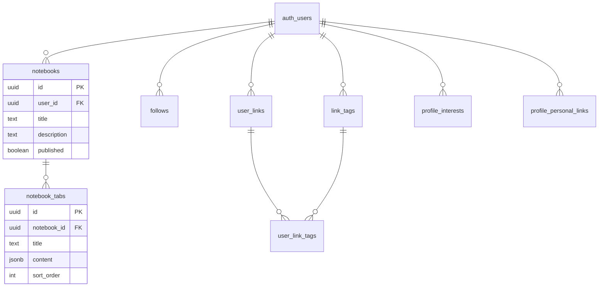
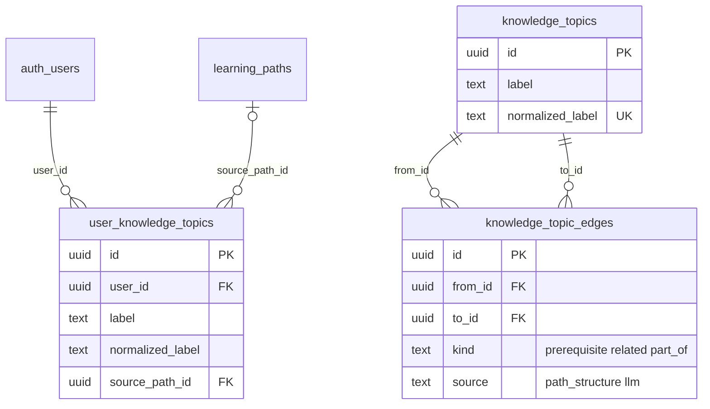
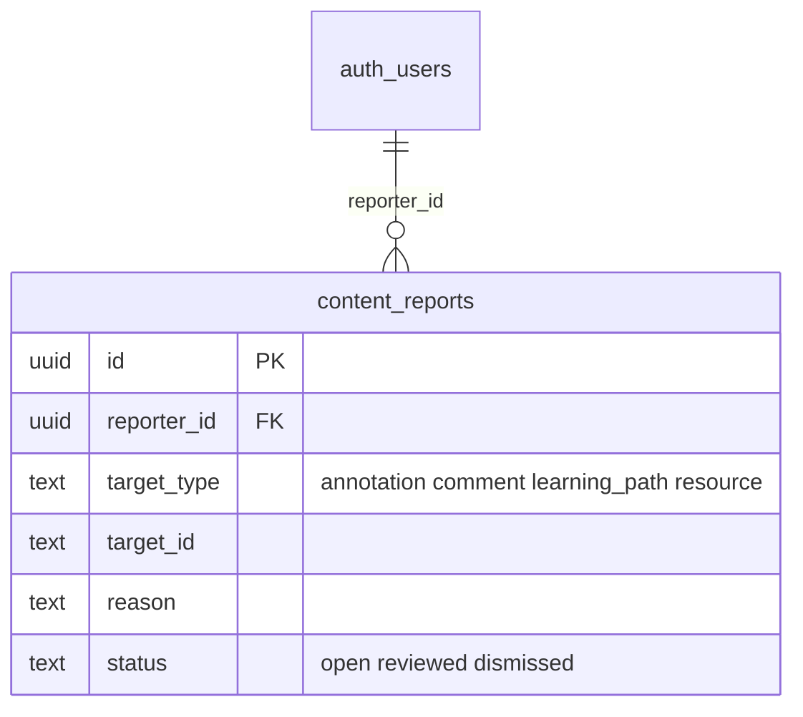
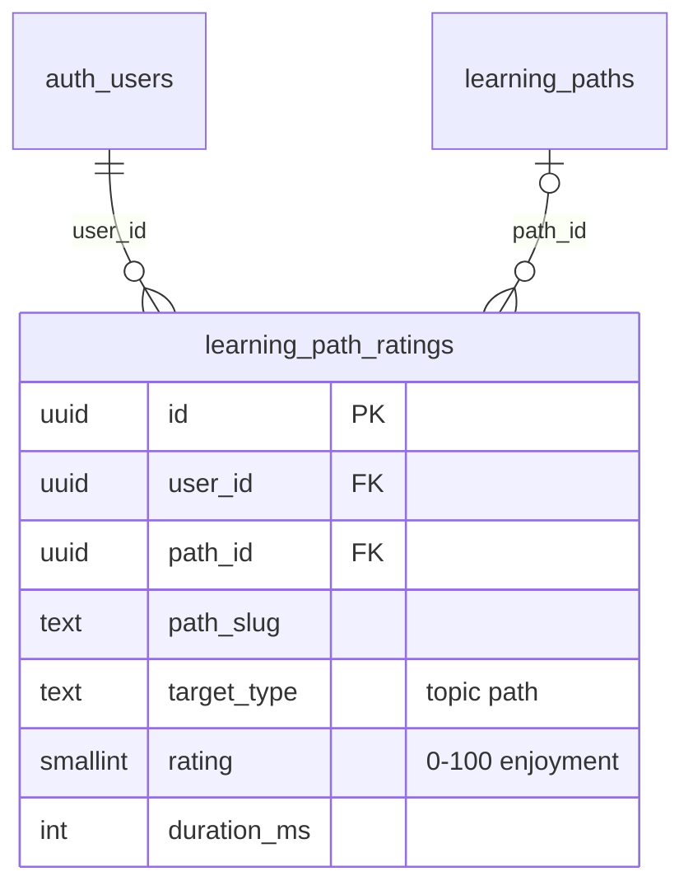

# Database

Fresh installs: apply SQL in [`supabase/migrations/`](../supabase/migrations/README.md). Prefer `000_complete_schema.sql` (includes `001`–`030`, `034`–`038`, and `040`, with `rating` already 0–100). Existing DBs that already ran an older 1–5 `038` should also apply `039`. Apply `040` so collaborative paths cannot rewrite the outline.

## Table groups

```mermaid
flowchart TB
  subgraph Identity
    auth_users["auth.users"]
    profiles["profiles"]
  end

  subgraph NotionActivity["Notion + path activity"]
    courses["courses<br/>(PK notion_page_id)"]
    comments["comments"]
    bookmarks["bookmarks"]
    annotations["annotations"]
    progress["course_section_progress"]
    courseNotes["course_notes"]
  end

  subgraph Wall["Legacy Community Wall"]
    wall["course_resources<br/>+ votes/comments/bookmarks"]
    wall_sub["community_wall_subscriptions"]
  end

  subgraph Polymorphic
    votes["votes<br/>comment · annotation · resource · course_video"]
  end

  subgraph Social
    follows["follows"]
    links["user_links · link_tags"]
    interests["profile_interests"]
    personal["profile_personal_links"]
  end

  subgraph Notebooks
    notebooks["notebooks"]
    tabs["notebook_tabs"]
  end

  subgraph CommunityPage["/community-resources"]
    resources["resources"]
    kc["knowledge_components"]
  end

  subgraph Curated["Course syllabus backup"]
    cvc["curated_courses"]
    nodes["curated_course_nodes"]
    nodeRes["curated_course_node_resources"]
    videos["curated_course_videos"]
    clinks["curated_course_links"]
    ccr["curated_course_resources"]
    cnotes["curated_course_notes"]
    cpins["curated_course_pins"]
  end

  subgraph Paths["learning_paths"]
    lp["learning_paths<br/>community · research · course"]
    lpState["learning_path_user_state"]
    lpPins["learning_path_pins"]
    lpCommit["learning_path_commitments"]
  end

  subgraph Knowledge["Knowledge"]
    ukt["user_knowledge_topics"]
    kt["knowledge_topics"]
    ke["knowledge_topic_edges"]
  end

  subgraph Reports["Reports"]
    cr["content_reports"]
  end

  auth_users --> profiles
  auth_users --> comments
  auth_users --> bookmarks
  auth_users --> annotations
  auth_users --> votes
  auth_users --> notebooks
  auth_users --> courseNotes
  auth_users --> cnotes
  auth_users --> lp
  courses --> comments
  courses --> bookmarks
  courses --> annotations
  courses --> wall
  courses --> wall_sub
  courses --> courseNotes
  courses -.-> cvc
  cvc --> nodes
  nodes --> nodes
  nodes --> videos
  nodes --> clinks
  nodes --> nodeRes
  cvc --> ccr
  cvc --> cpins
  lp --> lpState
  lp --> lpPins
  auth_users --> lpCommit
  auth_users --> ukt
  auth_users --> cr
  kt --> ke
  notebooks --> tabs
```

## Core ERD (identity + activity)

`courses.notion_page_id` is a text PK. It is a real Notion id for professor courses, or a synthetic id for path activity (`learning-path:{slug}`, `course-learning-path:{slug}`).

Official Notion courses are **not** on `learning_paths` yet. Degree syllabi (`kind = course`) already are. A later migrate will move Notion professor courses onto `learning_paths` as well; until then do not reuse Notion page ids as path slugs or merge activity prefixes. See [architecture — Future](./architecture.md#future-official-notion-courses).

`course_notes` is one TipTap document per `(user_id, course_id, topic_id)`. `topic_id` is the TOC tab key (or `parent::child` for a sub-tab). Empty `topic_id` is a read fallback from the earlier one-doc-per-course shape. The signed-in owner's notes appear on `/profile` → **Notes**, where they can be edited. **Open** sends you to that topic (`?node=` on a learning path, `?topic=` on a Notion course) with the notes side panel open (`?notes=1`). The same notes also live in `learning_path_user_state`.

## Three “resource” concepts

| Tables                                              | Used by                                                   | Meaning                                                       |
| --------------------------------------------------- | --------------------------------------------------------- | ------------------------------------------------------------- |
| `course_resources` (+ votes / comments / bookmarks) | **Legacy** Community Wall; profile feed still reads these | Per-course wall posts. Not shown on the course TOC anymore.   |
| `resources` + `knowledge_components`                | `/community-resources`                                    | Site-wide library + FTS (`search_community`)                  |
| `learning_paths.data` (`kind=course`)               | Course learning path syllabus + Resources nav             | Topic tree and sequenced resources                            |
| `curated_course_*`                                  | Backup / migrate source                                   | Previous syllabus tables (not written by the app after `027`) |

## Course learning path ERD

Live identity is `learning_paths` (`kind = course`). Route: `/learning-path/{slug}`. Legacy `/course-learning-path/{slug}` and `/curated-course/{slug}` redirect here. `curated_*` tables stay as backup.

Backup tables (`curated_courses`, nodes, videos, links, node_resources, resources, notes, pins) are unchanged. `025` copied videos/links into `curated_course_node_resources`. The migrate script copies assembled trees into `learning_paths.data`.

Votes for clips still use `votes.target_type = 'course_video'` keyed by resource/video UUID inside the JSON.

Backup `curated_*` ERD (tables retained; app no longer reads/writes them after cutover):

`curated_course_videos` and `curated_course_links` still exist as backup. Repair scripts for old names: `015_rename_course_video_to_curated.sql`, `016_fix_curated_table_names.sql`. Do **not** run those on a fresh DB.

## Learning path ERD

| Column / table                 | Role                                                                                                                                                                                                           |
| ------------------------------ | -------------------------------------------------------------------------------------------------------------------------------------------------------------------------------------------------------------- |
| `is_catalog`                   | Seeded public examples (`owner_id` must be null). User paths must have an owner.                                                                                                                               |
| `visibility`                   | `private` / `public` / `collaborative`. Catalog rows are `public`. Owned paths may switch from private to public/collab only when every topic has a filled why and at least 2 resources (client gate + modal). |
| `is_private`                   | Kept in sync with `visibility = 'private'` for one release.                                                                                                                                                    |
| `kind`                         | `community` (default), `research` (Field Atlas), or `course` (degree syllabus). Official Notion courses are not a kind yet.                                                                                    |
| `is_filled`                    | Derived for `kind=course`: true when `data.topics` has at least one topic with children. Title-only catalog stubs stay false. The **courses** view of `/all-courses` lists only filled course paths.           |
| `data`                         | Graph JSON (community/research) or `CourseLearningPathData` (course). Community/research outline is owner-only; catalog course syllabus JSON stays writable for signed-in users. Existing DBs: apply `040_learning_path_outline_owner_only.sql`. |
| `learning_path_user_state`     | Per-learner overlay: TipTap notes, extra resources, node status.                                                                                                                                               |
| `learning_path_pins`           | Per-user pinned **course** syllabi.                                                                                                                                                                            |
| `learning_path_resource_votes` | Upvotes on a resource list item. Independent of sequence. Public + collaborative paths only. `/community` diagrams this (`ResourceVoteSchemaDiagram`).                                                         |
| `learning_path_commitments`    | Per-user committed flag on a Learning tab item. Owner-only. Profile filter **Committed**. Later: reminders to finish the path. Existing DBs: apply `030_learning_path_commitments.sql`.                        |

Saving someone else’s community path is a `user_links` row whose URL is `/learning-path/{slug}` — not a separate saves table.

Index `learning_paths_public_research_goal_idx` (`026`/`027`) speeds Field Atlas lookup of a public research path by `goal` (`visibility = 'public'`).

## Social + notebooks

## Knowledge

Per-user acquired topics plus a shared catalog used by the Knowledge Graph view. See [knowledge.md](./knowledge.md).

The daily Gemini job that would add `source = llm` edges is **disabled**. Structural edges (`path_structure`) still ingest when someone finishes a public path.

## Reports

Flagged annotations, comments, learning paths, and uploaded resources. Dashboard: `/reports`.

Existing DBs: apply `037_content_reports.sql`. Public SELECT is open for testing; insert is owner-only.

## Ratings

After a learner marks a topic explored, a popup asks how long it took and a 0–100% rating of how enjoyable learning that module was with the given resources. Finishing the whole path/course asks the same for the entire map. Signed-in rows go to `learning_path_ratings` (`038`; apply `039` if an older 1–5 `rating` check is already live). Duration is what the learner types (hours and minutes).

## RPCs

| Function                    | Purpose                                       |
| --------------------------- | --------------------------------------------- |
| `handle_new_user()`         | Trigger: create `profiles` on signup          |
| `list_users_directory(...)` | `/users` pagination + interest filter         |
| `search_community(q, max)`  | FTS over `resources` + `knowledge_components` |
| `delete_*_votes()`          | Clean polymorphic votes on delete             |

## RLS pattern (summary)

- **Public read** for social content (profiles, comments, catalog/public learning paths, curated courses, published notebooks).
- **Owner write** (`auth.uid() = user_id` / `owner_id`).
- **Courses** (Notion / synthetic refs): anyone can insert/update (no PII; created on first visit).
- **Curated syllabus tree + node resources**: public read; any authenticated user can mutate (curation left open).
- **`learning_paths`**: catalog or `visibility in (public, collaborative)` is readable; owner mutates metadata and community/research `data` (outline). Signed-in users may patch `data` only on catalog courses. Collaborative visibility does not grant outline edits.
- **`learning_path_user_state` / `course_notes` / `learning_path_pins` / `learning_path_commitments`**: owner only.
- **`user_knowledge_topics`**: public read; owner insert/delete.
- **`knowledge_topics` / `knowledge_topic_edges`**: public read; writes via service role (ingest API; daily LLM cron is off).
- **`content_reports`**: public read (testing); signed-in users insert their own rows. Restrict `/reports` later via `REPORTS_DASHBOARD_OPEN`.
- **`learning_path_ratings`**: owner read/write; localStorage fallback when signed out or `038` is missing.
- **`learning_path_resource_votes`**: readable when the path is; any signed-in user may upvote on `public` / `collaborative` paths. Votes do not change resource sequence.
- **`user_links.is_private`**: filtered in app code, not RLS.
