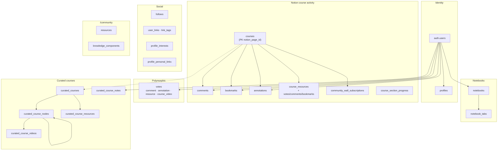
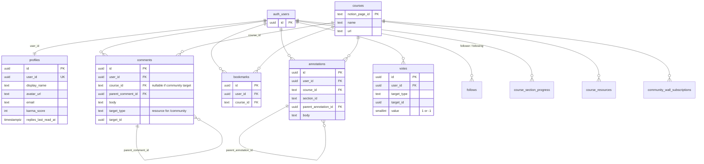
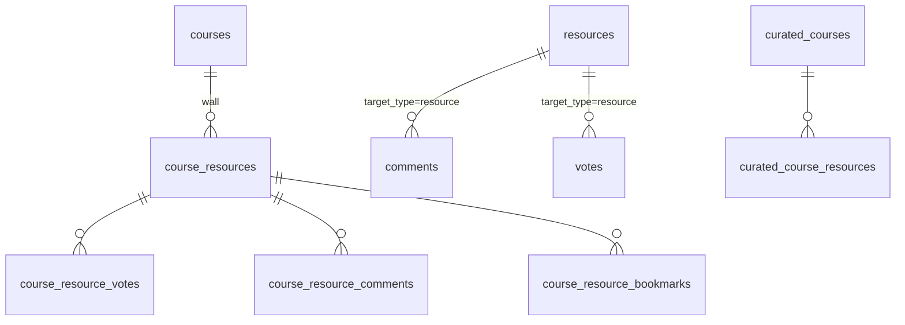
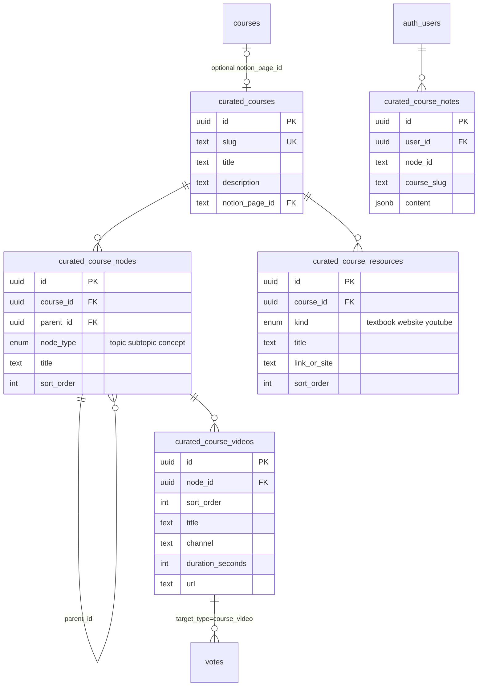
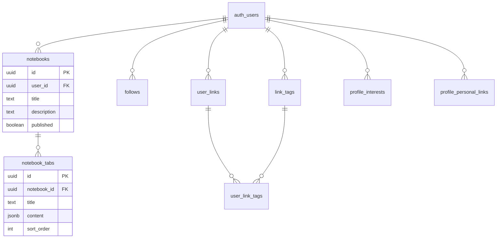

# Database

Fresh installs: apply SQL in [`supabase/migrations/new/`](../supabase/migrations/new/README.md) (prefer `000_complete_schema.sql`, which includes curated courses through `014`).

## Table groups

## Core ERD (identity + Notion activity)

## Community wall vs site community

Two different “resource” concepts:

| Table | Used by | Meaning |
|-------|---------|---------|
| `course_resources` (+ `_votes`, `_comments`, `_bookmarks`) | Course **Community Wall** on a Notion course page | Per-course posts |
| `resources` + `knowledge_components` | `/community` | Site-wide library + FTS (`search_community`) |
| `curated_course_resources` | `/curated-course/{slug}` Resources nav | Textbooks / websites / channels |

## Curated course ERD

### Table name map (current)

| Table | Role |
|-------|------|
| `curated_courses` | Catalog row per slug (`fluid-mechanics`, …) |
| `curated_course_nodes` | Syllabus tree (topic / subtopic / concept) |
| `curated_course_videos` | Ordered videos on a node |
| `curated_course_resources` | Textbooks / websites / channels |
| `curated_course_notes` | Per-user TipTap notes |

> Do **not** confuse with Community Wall `course_resources`, or legacy names `course_video_*` / `curated_courses_course`. Repair scripts: `015_rename_course_video_to_curated.sql`, `016_fix_curated_table_names.sql`.

Votes still use polymorphic `target_type = 'course_video'` (string discriminant, not a table name).

## Social + notebooks

## RPCs

| Function | Purpose |
|----------|---------|
| `handle_new_user()` | Trigger: create `profiles` on signup |
| `list_users_directory(...)` | `/users` pagination + interest filter |
| `search_community(q, max)` | FTS over `resources` + `knowledge_components` |
| `delete_*_votes()` | Clean polymorphic votes on delete |

## RLS pattern (summary)

- **Public read** for social content (profiles, comments, curated courses, published notebooks).
- **Owner write** (`auth.uid() = user_id` / author columns).
- **Courses** (Notion refs): anyone can insert/update (no PII; created on first visit).
- **Curated video tree**: public read; any authenticated user can mutate (curation left open).
- **`user_links.is_private`**: filtered in app code, not RLS.
