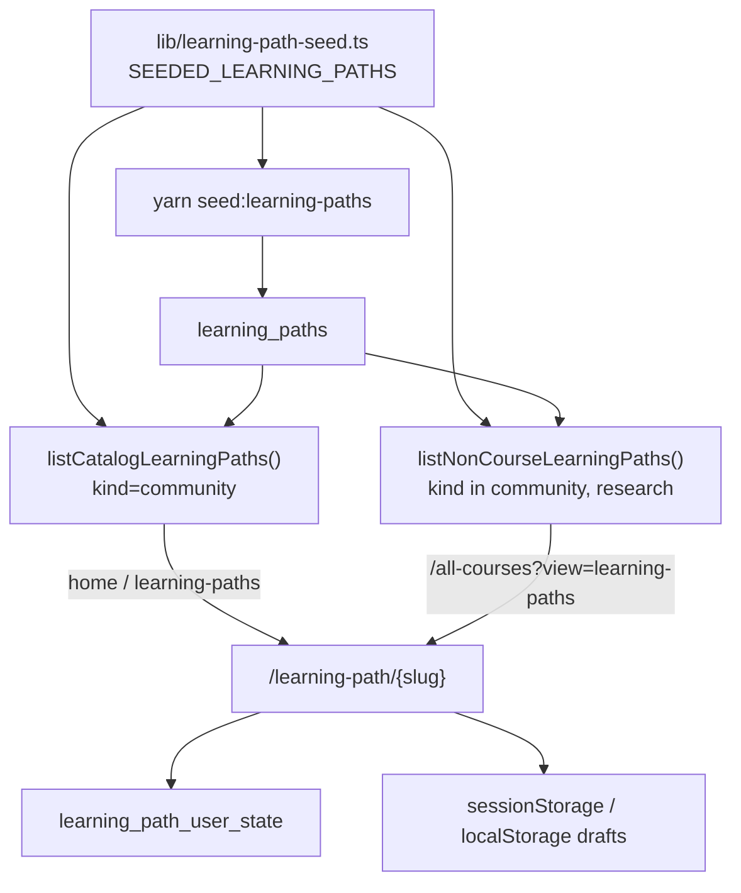

# Community learning paths

Goal-based maps at `/learning-path/{slug}`. Degree syllabi use the **same route** with `kind = course` (see [curated-courses.md](./curated-courses.md)).

## What they are

A path starts from a **goal** (“play a song on guitar”), then a graph of concepts, prerequisites, and milestones, each with resources and notes. People can keep a path private, publish it, or open it for collaboration.

Three kinds (`learning_paths.kind`):

| Kind                  | UI                                                                       | How it is created                                                                           | Where it shows                                                                                                                                                                                                       |
| --------------------- | ------------------------------------------------------------------------ | ------------------------------------------------------------------------------------------- | -------------------------------------------------------------------------------------------------------------------------------------------------------------------------------------------------------------------- |
| `community` (default) | Shared `LearningPath` shell · kicker “Learning Path” · community outline | Home / `/learning-paths` / `/all-courses` learning-paths view / profile → “create your own” | Home catalog, community lists, `/all-courses?view=learning-paths`, profile **Learning paths** filter                                                                                                                 |
| `research`            | Same shell · kicker “Research Learning Path” · community outline         | Field Atlas question → `/learning-path/new?kind=research`                                   | Profile **Learning paths** filter, header pin empty-state, `/all-courses?view=learning-paths`                                                                                                                        |
| `course`              | Same shell · kicker “Course Learning Path” · syllabus outline            | Migrated / seeded degree syllabus                                                           | Degrees, `/all-courses` **courses** view (filled syllabi only), course pins, profile **Courses** filter — **not** the home community grid, the all-courses learning-paths view, or the profile Learning paths filter |

Official professor courses from Notion are **not** a `kind` yet. They stay at `/course/{pageId}`. A later migrate will move those onto `learning_paths` as well; do not do that until that pass is designed. See [architecture — Future](./architecture.md#future-official-notion-courses).

## Routes

| Route                              | UI                                                                                                                                                        |
| ---------------------------------- | --------------------------------------------------------------------------------------------------------------------------------------------------------- |
| `/learning-paths`                  | Catalog + “your paths”, search, create modal                                                                                                              |
| `/all-courses?view=learning-paths` | Public **community + research** cards (`listNonCourseLearningPaths`). Title dropdown vs All Courses. Atlas callouts; empty search opens the create modal. |
| `/learning-path/new?goal=…`        | Outline builder, then redirect to the new slug. Sign-in stores the outline (`sessionStorage` + `localStorage`) and returns here.                          |
| `/learning-path/{slug}`            | Shared learning-path shell. `kind` only changes the title kicker and the left outline. Visitors see **Published Publicly** / **Published Collaboratively** on the date line; only the owner can **Edit this node** / **Add to path**. **Export Context** (next to Annotations / Your Notes) copies an LLM prompt: current step and ancestors, the numbered outline (mark and title on one line, with each topic’s why), and the goal/summary. |

Home (“Try learning paths from our community”) shows the first 12 **community** catalog rows in a 3-column grid. Empty course placeholders are excluded (`listCatalogLearningPaths` filters `kind = 'community'`).

The profile **Learning** tab filters are **Courses**, **Learning paths**, **By you**, and **Committed**. Courses = an official Notion course bookmark **or** a `learning_paths` row with `kind=course` (`isCourseKindPath`). Learning paths = `community` + `research` only. **Committed** is a per-user flag (click Commit; hover Committed → Uncommit) in `learning_path_commitments`; reminders to finish the path are not built yet. Existing DBs: apply `030_learning_path_commitments.sql`.

Profile tabs also include **Knowledge** (acquired topics + optional graph) and **Notes** (your private topic notes from courses and learning paths; `/profile` only; editable, with Open jumping to that topic and the notes panel). Finishing a path records unique node labels, shows blue confetti and a concepts modal, and adds a **What you learned** outline row. Hover **Explored** on the topic action to **Mark unexplored**. Completing a topic (or the whole path) asks how long it took and how enjoyable learning was with the given resources (0–100%). The left outline shows the topic name and a status square only (blue filled = explored); it does not print Exploring / Need this / As deep as you need. See [knowledge.md](./knowledge.md). Daily Gemini linking of the shared catalog is **implemented but disabled**.

`/all-courses?view=learning-paths` is the full public browse of non-course paths: `listNonCourseLearningPaths()` selects `kind in ('community','research')` (title, goal, summary only — not the JSON blob), then appends any missing `SEEDED_LEARNING_PATHS`. Private rows stay hidden by RLS. **`kind=course` is excluded**, including empty stubs.

## Data flow



`listCatalogLearningPaths()` reads public **community** catalog rows from Supabase, then **appends** any seeded path whose slug is not already in the DB. That way new seeds show on home before you re-run the seed script. Use that for the home grid. Use `listNonCourseLearningPaths()` for the all-courses learning-paths view (community **and** research).

`listAllLearningPathSlugs()` includes **every** `learning_paths` slug (community + course + research) so a new path cannot steal `fluid-mechanics`.

Signed-out edits live in `sessionStorage` (`LEARNING_PATH_STORAGE_KEY`). Signed-in owners upsert `learning_paths`; every learner’s notes/resources/status go in `learning_path_user_state`.

Saving a path you do not own writes a `user_links` row to `/learning-path/{slug}`. Bookmarking a resource (icon left of edit) writes another `user_links` row: the resource URL, or `/learning-path/{slug}?node=&resource=` when there is no href. Those query rows are not treated as saving the whole path.

## Catalog seeds

`SEEDED_LEARNING_PATHS` in `lib/learning-path-seed.ts`:

| Title                   | Slug                                                            |
| ----------------------- | --------------------------------------------------------------- |
| Learn Spanish           | `learn-spanish`                                                 |
| Implement a transformer | `understand-how-transformers-work-well-enough-to-implement-one` |
| Write a rom-com novel   | `write-a-rom-com-novel`                                         |
| Build a tree house      | `build-a-tree-house`                                            |
| Host a dinner           | `host-a-dinner`                                                 |
| Play a song on guitar   | `play-a-song-on-guitar`                                         |

Seed into Supabase with `yarn seed:learning-paths` (service role; refuses the production project). Sets `kind = community`, `visibility = public`.

## JSON in `learning_paths.data`

Community / research:

```text
{
  slug, title, goal, summary
  nodes[]   id, label, kind: goal | concept | prerequisite | milestone
            status, sequence, x, y, description, why, resources[]
            sub   still stored (seeded “Need this” / “As deep as you need”
                  are hidden in the outline and on the map)
  edges[]   from, to
  circle    name, description, members[]
}
```

Course (`kind = course`) uses the syllabus tree shape documented in [curated-courses.md](./curated-courses.md).

User overlay (`learning_path_user_state`):

- `notes` — TipTap JSON per node id (community paths and course syllabi)
- `resources` — extra resources the learner added
- `node_status` — `explored` / `exploring` / `next`. The learner can toggle a topic back to `next` from **Explored** in the main pane. The outline square is blue when `explored`, outlined blue when `exploring`, grey otherwise.

## Visibility

Replaces the old boolean `is_private`. The column remains, kept in sync (`is_private = visibility = 'private'`).

| Value           | Read       | Outline (add / edit / delete nodes) | Add / reorder resources                                      | Upvote resources   |
| --------------- | ---------- | ----------------------------------- | ------------------------------------------------------------ | ------------------ |
| `private`       | Owner only | Owner                               | Owner                                                        | No                 |
| `public`        | Anyone     | Owner                               | Owner                                                        | Any signed-in user |
| `collaborative` | Anyone     | Owner                               | Owner (official list); any signed-in user may suggest        | Any signed-in user |

- Catalog community / research / course rows: `visibility = public`, `owner_id` null.
- New user paths: `visibility = private` until the owner changes it. Going back to private is always allowed.
- Visitors (not the owner) see the mode on the hero date: **Published Publicly · Aug 2026** or **Published Collaboratively · Aug 2026**. The owner’s date line stays **Published**; they already have the Private / Public / Collab control. Catalog course syllabi stay **Published** (no public/collab toggle).
- Outline edits (**Edit this node**, **Add to path**, delete node) are owner-only, including on collaborative paths. List footer and graph popout hide those controls for everyone else. Signed-out local drafts still count as the owner. Apply `040_learning_path_outline_owner_only.sql` on existing databases.

### Publishing (private → public / collab)

The catalog should inherit a trail someone actually built, not an empty outline. `lib/learning-path-publish.ts` gates the switch:

| Required on every non-goal topic              | What counts                                                                                                                               |
| --------------------------------------------- | ----------------------------------------------------------------------------------------------------------------------------------------- |
| At least **2 resources**                      | Official `node.resources` plus the owner’s overlay (`learning_path_user_state.resources`)                                                 |
| A filled **Why is this on the learning path** | Non-empty `node.why`. Empty text and the old placeholder sentences (e.g. “You placed this because it sits inside the step.”) do not count |

If the bar is not met, the visibility control stays Private and **Finish topics to publish** lists the gaps (`N of 2 resources`, `Needs why`, or both). Click a row to jump to that topic; missing why opens the edit dialog.

When the switch succeeds, the owner’s overlay resources are copied onto `learning_paths.data` so visitors see the same list. New nodes start with a blank why. AI fill still counts when it wrote a real reason.

- RLS `SELECT`: `is_catalog OR visibility in ('public','collaborative') OR owner_id = auth.uid()`.
- RLS `UPDATE`: owner as before; signed-in users may update `data` only when `kind = 'course' AND is_catalog` (syllabus resources). Collaborative community/research outlines are owner-only. A trigger blocks non-owners from changing slug/owner/kind/visibility/title/goal/summary, and from changing `data` except on catalog courses.

Course catalog pages have no privacy toggle. Owned community/research paths use a three-way control.

**Export Context** (topic bar, next to Annotations / Your Notes) copies a prompt for an external LLM: the current step and its parents, the numbered outline with each topic’s why, then the goal and summary. Each outline row keeps the mark on the same line as the title (`1 Title`, `a) Title`, `i) Title`). Empty and placeholder whys are omitted. Course syllabi do not show this button.

Upvotes on a resource list are stored in `learning_path_resource_votes` and **do not change sequence**. The number in the list is still the study order; the arrow is a separate usefulness signal (idle brown, voted blue). Any signed-in user can upvote on a `public` or `collaborative` path — the control stays enabled except while a vote is saving. Apply `028_learning_path_resource_votes.sql` on existing databases. `/community` explains this with a schema diagram (`ResourceVoteSchemaDiagram`): sequence `1 2 3` vs ↑ votes, and the highest vote count is deliberately not on item 1.

## Activity

Comments and course-style bookmarks use `courses.notion_page_id = 'learning-path:{slug}'` for graph paths. Course syllabi keep `course-learning-path:{slug}` so existing threads are not orphaned.
