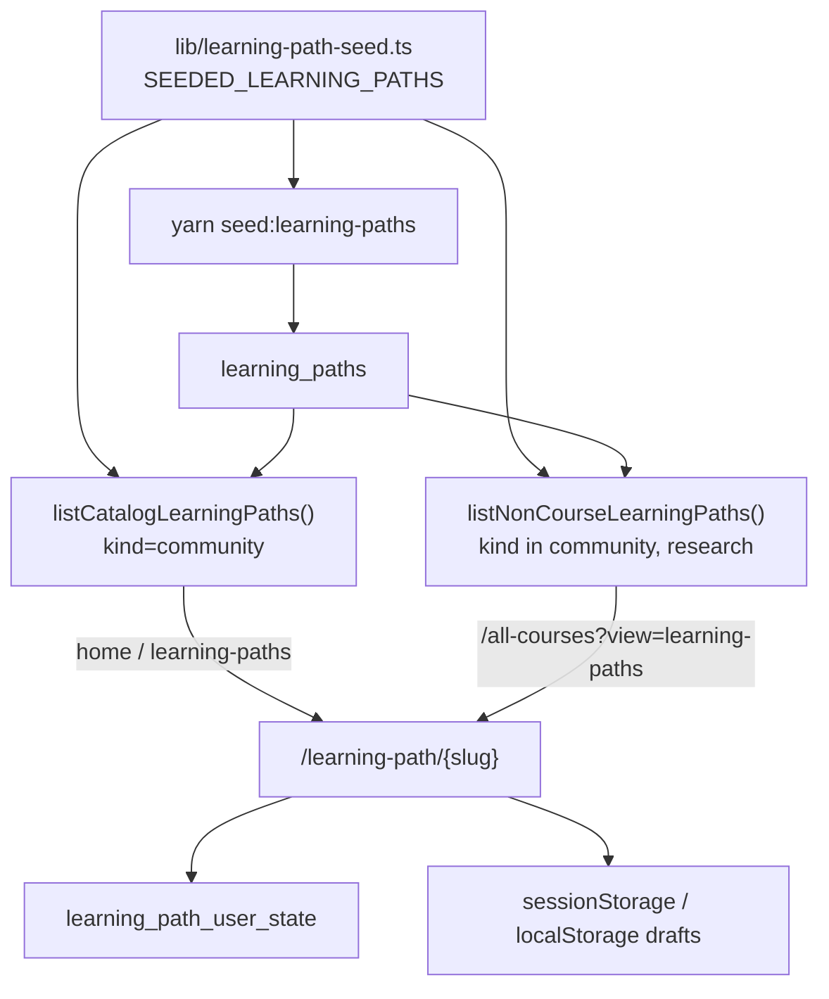

# Community learning paths

Goal-based maps at `/learning-path/{slug}`. Degree syllabi use the **same route** with `kind = course` (see [curated-courses.md](./curated-courses.md)).

## What they are

A path starts from a **goal** (“play a song on guitar”), then a graph of concepts, prerequisites, and milestones, each with resources and notes. People can keep a path private, publish it, or open it for collaboration.

Three kinds (`learning_paths.kind`):

| Kind                  | UI                                                                       | How it is created                                                                           | Where it shows                                                                                                                                                                                                       |
| --------------------- | ------------------------------------------------------------------------ | ------------------------------------------------------------------------------------------- | -------------------------------------------------------------------------------------------------------------------------------------------------------------------------------------------------------------------- |
| `community` (default) | Shared `LearningPath` shell · kicker “Learning Path” · community outline | Home / `/learning-paths` / `/all-courses` learning-paths view / profile → “create your own” | Home catalog, community lists, `/all-courses?view=learning-paths`, profile **Learning paths** filter                                                                                                                 |
| `research`            | Same shell · kicker “Research Learning Path” · community outline         | Field Atlas question → `/learning-path/new?kind=research`                                   | Profile **Learning paths** filter, header pin empty-state, `/all-courses?view=learning-paths`                                                                                                                        |
| `course`              | Same shell · kicker “Course Learning Path” · syllabus outline            | Migrated / seeded degree syllabus                                                           | Degrees, `/all-courses` **courses** view (filled syllabi only), course pins, profile **Courses** filter — **not** the home community grid, the all-courses learning-paths view, or the profile Learning paths filter |

Official professor courses from Notion are **not** a `kind` yet. They stay at `/course/{pageId}`. A later migrate will move those onto `learning_paths` as well; do not do that until that pass is designed. See [architecture — Future](./architecture.md#future-official-notion-courses).

The signed-in header pin menu lists saved courses and learning paths. Hovering a row (or focusing it) expands **N of M concepts explored** for paths and syllabi, or **topics** for official Notion courses, plus **Next: {topic}** and **Continue →**. Continue opens the first unexplored node (`?node=`) or TOC section (`?topic=`). Official saved courses load heading labels from the course page when local TOC is missing (`POST /api/course-toc`). On touch devices the resume panel stays open because hover is unreliable.

## Routes

| Route                              | UI                                                                                                                                                        |
| ---------------------------------- | --------------------------------------------------------------------------------------------------------------------------------------------------------- |
| `/learning-paths`                  | Catalog + “your paths”, search, create modal                                                                                                              |
| `/all-courses?view=learning-paths` | Public **community + research** cards (`listNonCourseLearningPaths`). Visible **All \| Learning Paths \| University Courses \| Degrees \| Research** filter vs unified Discover (omit `view`). Create-path promo in the grid when browsing; any search, including ones with matches, ends with **Can't find what you're looking for? Create your own path →**. |
| `/learning-path/new?goal=…`        | Outline builder, then redirect to the new slug. Sign-in stores the outline (`sessionStorage` + `localStorage`) and returns here. **Fill out this path for me** shows a watering-plant popup (**Watering your path.** / **Creating your steps.**) until the outline lands. |
| `/learning-path/{slug}`            | Shared learning-path shell. `kind` only changes the title kicker and the left outline. The hero date line is **publisher photo · Public** (or **Collab** / **Private**) **· Published Mon YYYY**, then a Save/••• chip (official-course Save style, bookmark icon). **•••** opens **Share** (copies the link), **Report**; owners also change visibility there. On a **private** path the owner can **Invite** a Coursetexts user by email to co-edit (no invitation email is sent). The owner and those invitees can **Edit this node** / **Add to path** while it stays private. Invitees’ own official resources show **Added by you** (`addedByUserId` on the resource JSON). A private slug you cannot read no longer renders an empty Coursetexts path: it shows **this learning path is private**. Signed-in visitors can **Request to join** (email stored on `learning_path_join_requests`; owner sees a banner on the path and on `/profile`). An unknown slug shows **this learning path doesn’t exist yet** with a create CTA. On **Collab**, visitors suggest resources (dotted card, **Resource suggestion added by you**); the owner **Accept**s them onto the official list. **Context** (next to Discussions / Your Notes) opens a dialog: what to paste into an LLM, plus the copied prompt (current step and ancestors, numbered outline with whys, goal/summary). |

Home (“Try learning paths from our community”) shows the first 12 **community** catalog rows in a 3-column grid. Empty course placeholders are excluded (`listCatalogLearningPaths` filters `kind = 'community'`). Copy to the left of **View all** explains publishing and resource votes, with a link to `/community`. The **What is a learning path?** diagram is a looping visual (`HomeLearningPathDiagram`) of goal → concepts → stacked resources → resource list → notes → commit/remind (**Josh · Committed** + Notify); resource chips have a faint type icon on the right (video, paper, exercise, book). It does not create a path.

The profile **Learning** tab filters are **Courses**, **Learning paths**, **By you**, and **Committed**. Courses = an official Notion course bookmark **or** a `learning_paths` row with `kind=course` (`isCourseKindPath`). Learning paths = `community` + `research` only. **Committed** is a per-user flag (click Commit; hover Committed → Uncommit) in `learning_path_commitments`. You can commit without a reminder. After you commit, a **Notify** tag appears to the right of Commit; saving a cadence (every day / weekday + local time) stores `reminder_frequency`, `reminder_minute`, and `reminder_timezone` on that row. You cannot set a reminder without committing. Sending those notifications is not built yet. Existing DBs: apply `041_learning_path_commitment_reminders.sql` (creates the commitments table if `030` was never applied). Community/research/course-kind cards show muted byline text under the title (**Created by you · Private**, or **By {name} · Public** / Collaborative). Paths you were invited to are not “Created by you”. Saved official Notion courses and pinned Coursetexts syllabi also get a byline (**By {professors} · {school} · Public** when the course page has been opened, otherwise **By {school} · Public** or **By Coursetexts · Public**). Cards with marked-complete sections or explored topics show a muted **97% complete** (etc.) tag to the left of Commit (hidden at 0%). A muted sprout **N day streak** tag sits to the left of **% complete** when the streak is greater than 0 (currently a few mocked titles only; real streak tracking is not built yet).

Profile tabs also include **Knowledge** (acquired topics) and **Notes** (your private topic notes from courses and learning paths; `/profile` only; editable, with Open jumping to that topic and the notes panel). Finishing a path records unique node labels, shows blue confetti and a concepts modal, and adds a **What you learned** outline row. The bottom **StepNavBar** shows **Mark as explored** (dark primary) and quiet **✓ Explored** after; click it to mark unexplored. Completing a topic (or the whole path) asks how long it took and how enjoyable learning was with the given resources (0–100%). The left outline shows the topic name and a light-blue stroke check when `explored` (parents and children). It does not print Exploring / Need this / As deep as you need. On a topic, **Why is this on the learning path:** is an inline lead plus body under the title. **Resources** start open. **Overview** has Resources only — no Why section (the path summary stays in the hero). On Overview, **Commit & Remind Me** sits on the bottom step bar next to **Start learning path** (opens the first outline step; syllabi with no topics yet jump to Resources). Official Notion courses use the same control on the **General** tab (`course:{notion_page_id}`). Official Notion courses, community paths, and course syllabi share that bar: **← Previous** (hidden on the first step), **N of M**, explored, and **Next →** (dark primary; **Finish path** on the last step). Below the path content, **Discuss this with others?** sits beside **People on this learning path** (study-circle members from `path.circle.members`). See [knowledge.md](./knowledge.md). Daily Gemini linking of the shared catalog is **implemented but disabled**.

## Left outline (community / research)

1. **Overview** — combined General Approach + Recommended Path (`?node=overview`). Resources only; no **Why is this on the learning path**. A 1px hairline sits under this row (none above it). **Commit & Remind Me** sits on the bottom step bar next to **Start learning path** (first topic, or Resources when the syllabus has no topics yet).
2. The topic tree. Top-level steps are accordion rows (chevron on the right). Nested steps sit on a vertical hairline. A light-blue stroke check appears on the right when a parent or child is `explored`.
3. **What you learned** — only after the path is finished

The topic bar has **Discussions** (table `annotations`; `?annotations=1` or `?discussions=1`) and **Your Notes**. On mobile (≤900px), **The Path** opens the outline drawer (same as community paths and official Notion courses’ **The Course**). In the notes side panel, **Export PDF** is under the toolbar **…** menu. Searching the outline for “mental map” or “general approach” still finds **Overview**. Course syllabi use the same **Overview** tab and accordion/check treatment (see [curated-courses.md](./curated-courses.md)).

`/all-courses?view=learning-paths` is the full public browse of non-course paths: `listNonCourseLearningPaths()` selects `kind in ('community','research')` (title, goal, summary only — not the JSON blob), then appends any missing `SEEDED_LEARNING_PATHS`. Private rows stay hidden by RLS. **`kind=course` is excluded**, including empty stubs.

## Data flow



`listCatalogLearningPaths()` reads public **community** catalog rows from Supabase, then **appends** any seeded path whose slug is not already in the DB. That way new seeds show on home before you re-run the seed script. Use that for the home grid. Use `listNonCourseLearningPaths()` for the all-courses learning-paths view (community **and** research).

`listAllLearningPathSlugs()` includes **every** `learning_paths` slug (community + course + research) so a new path cannot steal `fluid-mechanics`.

Signed-out edits live in `sessionStorage` (`LEARNING_PATH_STORAGE_KEY`). Signed-in owners upsert `learning_paths`; every learner’s notes/resources/status go in `learning_path_user_state`.

Saving a path you do not own writes a `user_links` row to `/learning-path/{slug}`. Bookmarking a resource (icon left of edit) writes another `user_links` row: the resource URL, or `/learning-path/{slug}?node=&resource=` when there is no href. Those query rows are not treated as saving the whole path.

## Catalog seeds

`SEEDED_LEARNING_PATHS` in `lib/learning-path-seed.ts`:

| Title                   | Slug                                                            |
| ----------------------- | --------------------------------------------------------------- |
| Learn Spanish           | `learn-spanish`                                                 |
| Implement a transformer | `understand-how-transformers-work-well-enough-to-implement-one` |
| Write a rom-com novel   | `write-a-rom-com-novel`                                         |
| Build a tree house      | `build-a-tree-house`                                            |
| Host a dinner           | `host-a-dinner`                                                 |
| Play a song on guitar   | `play-a-song-on-guitar`                                         |

Seed into Supabase with `yarn seed:learning-paths` (service role; refuses the production project). Sets `kind = community`, `visibility = public`.

## JSON in `learning_paths.data`

Community / research:

```text
{
  slug, title, goal, summary
  nodes[]   id, label, kind: goal | concept | prerequisite | milestone
            status, sequence, x, y, description, why, resources[]
            (resource may include addedByUserId when an invitee wrote it)
            sub   still stored (seeded “Need this” / “As deep as you need”
                  are hidden in the outline and on the map)
  edges[]   from, to
  circle    name, description, members[]
}
```

Course (`kind = course`) uses the syllabus tree shape documented in [curated-courses.md](./curated-courses.md).

User overlay (`learning_path_user_state`):

- `notes` — TipTap JSON per node id (community paths and course syllabi)
- `resources` — extra resources the learner added
- `node_status` — `explored` / `exploring` / `next`. The learner can toggle a topic back to `next` from **✓ Explored** in the bottom step bar. The outline shows a light-blue stroke check when `explored` (parents and nested steps).

## Visibility

Replaces the old boolean `is_private`. The column remains, kept in sync (`is_private = visibility = 'private'`).

| Value           | Read                    | Outline (add / edit / delete nodes) | Add / reorder resources                                      | Upvote resources   |
| --------------- | ----------------------- | ----------------------------------- | ------------------------------------------------------------ | ------------------ |
| `private`       | Owner + invited emails  | Owner + invitees                    | Owner overlay; invitees write the official list (those cards show **Added by you**) | No                 |
| `public`        | Anyone                  | Owner                               | Owner                                                        | Any signed-in user |
| `collaborative` | Anyone                  | Owner                               | Owner (official list); any signed-in user may **suggest**. Pending suggestions use a dotted card border and **Resource suggestion added by you** for the suggester. The owner can **Accept** (copies into the official list) or **Dismiss**. | Any signed-in user |

- Catalog community / research / course rows: `visibility = public`, `owner_id` null.
- New user paths: `visibility = private` until the owner changes it. Going back to private is always allowed.
- The hero date line always shows the mode: **Public · Published Mon YYYY**, **Collab · Published Mon YYYY**, or **Private · Published Mon YYYY**, with the publisher photo. A Save/••• chip sits on the right (bookmark icon, same chip as official-course Save). **•••** opens **Share** (copies the link) and **Report**; owners also pick Private / Public / Collab there. While the path is **private**, owners also get **Invite**: enter an email, we look up `profiles`, and if that person is on Coursetexts we store a row in `learning_path_invites`. No email is sent. The invitee can open the path while signed in with that address (JWT email or the user id captured at invite time). The owner can remove someone from the list. Signed-in visitors who open a private URL they cannot access see a gate with **Request to join**; that stores their email on `learning_path_join_requests`. The owner gets a banner on the path (and the Invite modal once per tab), plus a profile banner and Activity feed card, and can **Invite** or **Dismiss**. Catalog course syllabi use **Public · Published** (no visibility toggle).
- Outline edits (**Edit this node**, **Add to path**, delete node) are owner-only on public and collaborative paths. On a **private** path, named invitees can edit the outline and official resources too. Title, goal, summary, and visibility stay owner-only. Signed-out local drafts still count as the owner. Apply `040_learning_path_outline_owner_only.sql`, `042_learning_path_invites.sql`, `043_learning_path_public_access.sql`, and `044_learning_path_join_requests.sql` on existing databases.

This named-invite flow is separate from `visibility = 'collaborative'` (anyone can read; others suggest resources). Pending collab suggestions live in `learning_path_resource_suggestions` until the owner **Accept**s (writes `node.resources`) or **Dismiss**es them. The suggester’s card is dotted and labeled **Resource suggestion added by you**.

On a private path, invitees write official `node.resources` and store `addedByUserId` so that card shows **Added by you** for them. The owner’s extra resources stay in the overlay until publish.

### Publishing (private → public / collab)

The catalog should inherit a trail someone actually built, not an empty outline. `lib/learning-path-publish.ts` gates the switch:

| Required on every non-goal topic              | What counts                                                                                                                               |
| --------------------------------------------- | ----------------------------------------------------------------------------------------------------------------------------------------- |
| At least **2 resources**                      | Official `node.resources` plus the owner’s overlay (`learning_path_user_state.resources`)                                                 |
| A filled **Why is this on the learning path** | Non-empty `node.why`. Empty text and the old placeholder sentences (e.g. “You placed this because it sits inside the step.”) do not count |

If the bar is not met, the visibility control stays Private and **Finish topics to publish** lists the gaps (`N of 2 resources`, `Needs why`, or both). Click a row to jump to that topic; missing why opens the edit dialog.

When the switch succeeds, the owner’s overlay resources are copied onto `learning_paths.data` so visitors see the same list. New nodes start with a blank why. AI fill still counts when it wrote a real reason.

- RLS `SELECT`: `is_catalog OR visibility in ('public','collaborative') OR owner_id = auth.uid() OR is_learning_path_invitee(id)`.
- RLS `UPDATE`: owner as before; signed-in users may update `data` only when `kind = 'course' AND is_catalog` (syllabus resources), or when they are a private-path invitee. Collaborative community/research outlines stay owner-only. A trigger blocks non-owners from changing slug/owner/kind/visibility/title/goal/summary, and from changing `data` except on catalog courses or private invitee edits.

Course catalog pages have no privacy toggle. Owned community/research paths use the **•••** menu for Private / Public / Collab.

**Context** (topic bar, next to Discussions / Your Notes) opens a dialog that copies a prompt for an external LLM and explains to paste it into ChatGPT, Claude, or similar so the model knows where you are on the path. The prompt includes the current step and its parents, the numbered outline with each topic’s why, then the goal and summary. Each outline row keeps the mark on the same line as the title (`1 Title`, `a) Title`, `i) Title`). Empty and placeholder whys are omitted. Course syllabi do not show this button.

Upvotes on a resource list are stored in `learning_path_resource_votes` and **do not change sequence**. The number in the list is still the study order; the arrow is a separate usefulness signal (idle brown, voted blue). Any signed-in user can upvote on a `public` or `collaborative` path — the control stays enabled except while a vote is saving. Apply `028_learning_path_resource_votes.sql` on existing databases. `/community` explains this with a schema diagram (`ResourceVoteSchemaDiagram`): sequence `1 2 3` vs ↑ votes, and the highest vote count is deliberately not on item 1.

## Activity

Comments, discussions (`annotations` table), and course-style bookmarks use `courses.notion_page_id = 'learning-path:{slug}'` for graph paths. Course syllabi keep `course-learning-path:{slug}` so existing threads are not orphaned.
