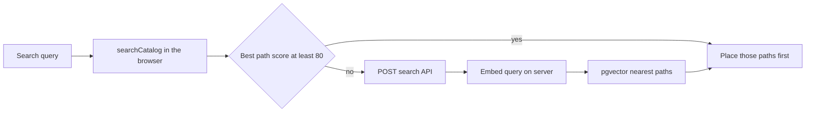

# Semantic learning-path search

Implementation plan for paraphrased catalog search. This is a spec for a teammate. The feature is not built yet.

When someone searches with different words than a path title (“make a chatbot” against a transformers path), return the best catalog-visible learning path. Cost should stay near zero as traffic grows. Use a small open-source embedding model on the server. Gemini stays on path fill only (`pages/api/fill-learning-path.ts`).

## Out of scope

- A generative model (Gemini, Llama, or any other chat model) ranking search results.
- Downloading or running the embedding model in the browser.
- Embeddings for degrees, Notion university courses, or Field Atlas questions. Those stay on the lexical scorer in `lib/catalog-search.ts`.
- Embeddings for private paths.
- Full outlines, resource bodies, or “why” text inside the embedding string.
- A second vector store for syllabi that exist only as JSON and have no `learning_paths` row.

## How search works today

Unified search on `/paths/all-courses` runs in the browser. `pages/paths/all-courses.tsx` builds `catalogItems` and calls `searchCatalog` from `lib/catalog-search.ts` inside a `useMemo`. The search box writes the query on every change (`onQueryChange={setQuery}`).

`scoreCatalogItem` scores token overlap. Title weight is 100, so an exact title is 400, a prefix is 300, a substring is 220, and full token overlap on the title is 160. `TOKEN_EXPANSIONS` only covers `transformer`, `nlp`, and `llm`. A paraphrase often scores 0, and a 0-score path never enters the hit list.

Learning-path hits use `kind: 'learning-path'`:

- Community and research cards: `communityPathToItem`. Live rows come from `listNonCourseLearningPaths` in `lib/learning-path-db.ts`. `rowToNonCourseCard` drops `visibility = 'private'`, and drops rows whose `visibility` is null when `is_private` is true. `public` and `collaborative` (“open to suggestions”) both stay in the catalog.
- Course syllabi: `syllabusToItem`. Filled syllabi start as `listFilledCuratedCourseCatalog()` (`data/curated-courses/{slug}.json`, card `id` is the slug) and are then merged with `listCourseLearningPaths()` (`kind = 'course'` and `is_filled`, card `id` becomes the database uuid).

Service-role access is `getSupabaseAdmin()` in `lib/supabase-admin.ts`. There is no `vector` extension yet (`supabase/migrations/001_extensions_and_enums.sql` only enables `pgcrypto`). The next migration number is `055`.

`lib/learning-path-db.ts` and `lib/course-learning-path-db.ts` are imported by client components. The embedder must not be imported from either file, or the model will be pulled toward the browser bundle.



## Embedding text

One string per catalog-visible path. Same model for every row.

Community and research (`LearningPathData` in `lib/learning-path-seed.ts`):

```text
{title}. {goal}. {summary}. Topics: {labels}
```

`labels` are `nodes` whose `kind` is not `goal`, joined with `, `. Use `node.label`. Skip empty labels.

Course syllabi (`CourseLearningPathData` in `lib/course-learning-path-types.ts`):

```text
{title}. {description}. Topics: {titles}
```

Walk `topics` and each node’s `children`. Use each node’s `title`. There is no separate goal field.

Skip resource titles, video titles, passages, and why strings.

## Model

- Package: `@xenova/transformers`
- Model id: `Xenova/bge-small-en-v1.5`
- Dimensions: 384
- Pooling: mean
- Normalize: true
- Device: CPU
- Path strings: embed as written above
- Search queries: prefix with `Represent this sentence for searching relevant passages: ` and then the user’s text. This model is trained with that query prefix. Path rows do not get the prefix.

Cache one pipeline instance in the server process. Pin the model id in a constant next to the `vector(384)` column so a model change cannot silently write the wrong width.

`content_hash` is the sha256 of `modelId + "\n" + embeddingText`. If the stored hash matches, skip the model.

Next.js 12 will try to bundle ONNX and break the API route. In the existing `webpack` function in `next.config.js`, when `isServer` is true, externalize the package:

```js
config.externals.push({
  '@xenova/transformers': 'commonjs @xenova/transformers',
  'onnxruntime-node': 'commonjs onnxruntime-node'
})
```

Import the embedder only from the API routes and `scripts/embed-learning-paths.ts`.

Sketch of the server helper (`lib/learning-path-embed.ts`):

```ts
import { pipeline, type FeatureExtractionPipeline } from '@xenova/transformers'
import { createHash } from 'crypto'

export const LEARNING_PATH_EMBED_MODEL = 'Xenova/bge-small-en-v1.5'
export const LEARNING_PATH_EMBED_DIM = 384
const QUERY_PREFIX = 'Represent this sentence for searching relevant passages: '

let extractor: FeatureExtractionPipeline | null = null

async function embed(text: string): Promise<number[]> {
  if (!extractor) {
    extractor = await pipeline('feature-extraction', LEARNING_PATH_EMBED_MODEL)
  }
  const output = await extractor(text, { pooling: 'mean', normalize: true })
  return Array.from(output.data as Float32Array)
}

export function learningPathEmbeddingHash(embeddingText: string): string {
  return createHash('sha256')
    .update(`${LEARNING_PATH_EMBED_MODEL}\n${embeddingText}`)
    .digest('hex')
}

export function embedLearningPathText(embeddingText: string) {
  return embed(embeddingText)
}

export function embedLearningPathQuery(query: string) {
  return embed(`${QUERY_PREFIX}${query}`)
}
```

Confirm the installed `@xenova/transformers` types. Adjust the `pipeline` generic if the package’s types differ. Keep the three exports and the two string rules.

## Database

Add `supabase/migrations/055_learning_path_embeddings.sql`.

```sql
create extension if not exists vector;

create table if not exists public.learning_path_embeddings (
  path_id uuid primary key references public.learning_paths (id) on delete cascade,
  model text not null,
  content_hash text not null,
  embedding vector(384) not null,
  updated_at timestamptz not null default now()
);

create index if not exists learning_path_embeddings_hnsw
  on public.learning_path_embeddings
  using hnsw (embedding vector_cosine_ops);

alter table public.learning_path_embeddings enable row level security;

-- No select/insert/update/delete policies. The service role bypasses RLS.
-- anon and authenticated cannot read vectors.

create or replace function public.match_learning_path_embeddings(
  query_embedding vector(384),
  match_count int
)
returns table (path_id uuid, slug text, distance float)
language sql
stable
as $$
  select
    p.id,
    p.slug,
    (e.embedding <=> query_embedding) as distance
  from public.learning_path_embeddings e
  join public.learning_paths p on p.id = e.path_id
  where p.visibility is distinct from 'private'
    and not (p.visibility is null and p.is_private is true)
    and (
      p.kind in ('community', 'research')
      or (p.kind = 'course' and p.is_filled is true)
    )
  order by e.embedding <=> query_embedding
  limit greatest(1, least(match_count, 24));
$$;

revoke all on function public.match_learning_path_embeddings(vector, int)
  from public, anon, authenticated;
grant execute on function public.match_learning_path_embeddings(vector, int)
  to service_role;
```

`<=>` is cosine distance (lower is closer). Call the function with `getSupabaseAdmin()`, never with the browser Supabase client.

## Who gets a vector

Embed a `learning_paths` row when it is catalog-visible:

- `kind` is `community` or `research`, and visibility is `public` or `collaborative` (same rule as `rowToNonCourseCard`).
- `kind` is `course` and `is_filled` is true.

On any other row, delete `learning_path_embeddings` for that `path_id` if a row exists. Deleting the path already cascades.

JSON syllabi and seeded cards that were never inserted into `learning_paths` have nothing to point `path_id` at. The backfill covers database rows only. `scripts/seed-learning-paths.ts` and `scripts/migrate-course-learning-paths.ts` are how those rows get into the table. Run the backfill after those, not instead of them.

## Backfill

`scripts/embed-learning-paths.ts`, run with `npx tsx`, following `scripts/seed-learning-paths.ts` (service role, refuse a project ref that does not match the target URL).

Add a `package.json` script beside `seed:learning-paths`:

```json
"embed:learning-paths": "npx tsx scripts/embed-learning-paths.ts"
```

The script loads catalog-visible rows, builds the embedding text, and upserts when `content_hash` differs. It deletes embedding rows for paths that are no longer catalog-visible.

## Refresh after an edit

Saves run in the browser. `upsertOwnedLearningPath`, `setOwnedLearningPathVisibility`, and `updateLearningPathDataAsInvitee` live in `lib/learning-path-db.ts`. Course outline writes go through `saveCoursePathData` in `lib/course-learning-path-db.ts`. None of these may import the embedder.

Add `pages/api/learning-path-embeddings.ts`:

- `POST` with `{ pathId: string }`. `pathId` must be a uuid.
- Auth: `getApiUser` from `lib/api-user.ts`, same as `pages/api/fill-learning-path.ts`. Reject signed-out callers.
- Load the path with the service role. Allow the request only when `owner_id` is the caller, or the caller is an accepted editor on that path (the same people `updateLearningPathDataAsInvitee` already allows). Reject everyone else.
- If the path is catalog-visible, upsert the embedding when the hash changed.
- If it is private or otherwise hidden, delete the embedding row.
- Return `{ ok: true }`. Do not return the vector.

Call this route after a successful save, without blocking the UI on failure:

- `components/LearningPath.tsx` and `components/LearningPathBuilder.tsx`, after `upsertOwnedLearningPath` resolves with an id. New inserts set `visibility: 'private'` inside `upsertOwnedLearningPath`, so skip the call on create. Call it on later saves when the path is `public` or `collaborative`.
- `components/LearningPath.tsx`, after `setOwnedLearningPathVisibility` succeeds. Call it for every visibility, including `private`, so the row is deleted when the path leaves the catalog.
- `components/LearningPath.tsx`, after `updateLearningPathDataAsInvitee` succeeds, when that path is `public` or `collaborative`.
- After `saveCoursePathData` succeeds for an `is_filled` course path. That helper is private, so call the route from the function that already invokes it, or from the end of `saveCoursePathData` via `fetch` only if that module is already running in the browser. Do not import `lib/learning-path-embed.ts` there.

## Search API

`pages/api/search-learning-paths.ts`

- `POST { query: string }`. Trim the query. Reject empty. Cap the stored text at 200 characters.
- No sign-in required. This is the public catalog.
- Cache key: `normalizeCatalogText` from `lib/catalog-search.ts`. In-memory `Map` on the module, TTL about 10 minutes. Cache the id/slug list, not vectors.
- Embed with `embedLearningPathQuery`.
- `match_learning_path_embeddings` with `match_count` 12 (same cap as `QUERY_MATCH_PER_GROUP` in `lib/catalog-search.ts`).
- Response:

```json
{ "matches": [{ "id": "uuid", "slug": "transformers" }] }
```

Include `slug` because course cards from `listFilledCuratedCourseCatalog` use the slug as `id` until `listCourseLearningPaths` replaces it with the uuid. The client matches either field. Do not return vectors or embedding text.

## Client merge

Leave `searchCatalog` in place. Change the `unified` memo in `pages/paths/all-courses.tsx`.

1. Compute today’s lexical result.
2. Let `bestPathScore` be the highest `scoreCatalogItem` among items with `kind === 'learning-path'`. If that score is at least 80, do not call the API. An exact title is 400, so a clear lexical hit never spends a model call.
3. If the trimmed query is shorter than 3 characters, do not call the API.
4. Otherwise debounce about 300ms, then `POST /api/search-learning-paths`.
5. Match returned rows to cards already loaded in `learningPaths` and `coursePaths`, by `card.id` or by the slug at the end of `card.href` (`learningPathCardSlug`). Ignore ids that are not on the page.
6. Turn matches into `learning-path` hits with `communityPathToItem` or `syllabusToItem`. Put them first in the learning-path group, in API order. Keep other learning-path hits after them, in lexical order, without duplicating a card.
7. If `bestMatch` is null, or its kind is `learning-path` and its score is below 80, set `bestMatch` to the first semantic hit and drop that hit from the group so it is not shown twice. `groupCatalogHits` already removes `bestMatch` from the groups; keep that behavior.
8. If `bestMatch` is a degree, university course, or research hit, leave it. Semantic results only fill the learning-path group.
9. If the request fails, render the lexical result.

Degree, university-course, and research groups stay on `searchCatalog`. The filtered learning-paths view (`filteredLearningPaths`) is a separate substring filter. Apply the same id order there when a debounced semantic result exists, so the Goal-based view and the unified view agree. Cards with no semantic rank stay in their current order after the ranked ones.

## Tests

- “make a chatbot” ranks a transformers-style public path ahead of an unrelated public path when the titles share no tokens. The transformers path becomes `bestMatch` when lexical search had no stronger non-path hit.
- An exact title match does not call `/api/search-learning-paths`.
- A private path is absent from `match_learning_path_embeddings` and from the HTTP response.
- A `collaborative` path can be returned. It is already on the catalog.
- Changing a title changes `content_hash` and re-embeds. Saving without a text change does not call the model.
- Setting visibility to `private` deletes the embedding row.
- A failed or slow search API leaves the lexical `/paths/all-courses` results on screen.
- Degree, university-course, and research groups are unchanged for the same query.
- A signed-out `POST /api/learning-path-embeddings` is rejected. A signed-in user cannot refresh a path they do not own or edit.
