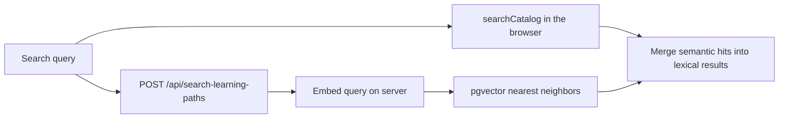

# Semantic catalog search

Shipped. Paraphrased search over catalog-visible learning paths and Notion university courses, using a small open-source embedding model on the server. Gemini stays off the live search box (path fill, plus **index-time related terms** — see [How catalog search works](../../catalog-search.md)).

## Surfaces

| Page                                                      | Semantic sources                                                                        |
| --------------------------------------------------------- | --------------------------------------------------------------------------------------- |
| [`/all-courses`](../../pages/all-courses.tsx)             | Notion university courses only (`kinds: ['university-course']`)                         |
| [`/paths/all-courses`](../../pages/paths/all-courses.tsx) | Learning paths **and** Notion courses (`kinds: ['learning-path', 'university-course']`) |

Lexical search (`lib/catalog-search.ts`) still runs in the browser. Degrees and Field Atlas research questions stay lexical-only.

## Out of scope

- A generative model ranking live search results or scoring the whole catalog per keystroke.
- Running the embedding model in the browser.
- Embeddings for degrees or Field Atlas questions.
- Embeddings for private / hidden paths.
- Full outlines, resource bodies, or “why” text inside the embedding string.
- Live re-embed on every path save (refresh via backfill scripts for now).

## How it works



1. For every trimmed query of length ≥ 3, debounce ~300ms and `POST /api/search-learning-paths`.
2. Always merge semantic neighbors into the UI (do **not** skip the API when lexical scores are strong).
3. Strong lexical hits (score ≥ 80) keep `bestMatch`; semantic neighbors still fill the related groups.
4. If the API fails, keep the lexical result.

### API

`POST /api/search-learning-paths`

```json
{
  "query": "make a chatbot",
  "kinds": ["learning-path", "university-course"]
}
```

- `kinds` optional; default `["learning-path"]`.
- Allowed values: `learning-path`, `university-course`.
- Response: `{ "matches": [{ "kind": "learning-path", "id": "uuid", "slug": "…" }, { "kind": "university-course", "id": "notion-page-id" }] }`.
- Query capped at 200 chars. In-memory cache (~10 min) keyed by normalized query + kinds.
- Embeds once, runs the matching RPC(s), interleaves by distance, caps at 12.

### Client helpers

[`lib/semantic-learning-path-search.ts`](../../lib/semantic-learning-path-search.ts) — gate, card match, `orderCardsBySemanticMatches`, `mergeSemanticCatalogSearch`.

## Embedding text

**Learning paths** ([`lib/learning-path-embedding-text.ts`](../../lib/learning-path-embedding-text.ts)):

- Community / research: `{title}. {goal}. {summary}. Topics: {label}: {description}` (goal nodes skipped; `why` and resource titles stay out)
- Course syllabi: `{title}. {description}. Topics: {title}: {description}` (walk `topics` children; resource titles stay out)

Topic descriptions are clipped (~160 chars) and the full string is capped (~2400 chars) so BGE’s 512-token window still sees the title.

Search queries are expanded with a small shared synonym list in [`lib/catalog-search-synonyms.ts`](../../lib/catalog-search-synonyms.ts) (`english` → publishing / literature, `black scholes` → options / finance). The same list feeds lexical extras. That list is a stopgap, not the long-term design.

**Shipped (index time):** `yarn embed:related-terms` calls Gemini once per catalog item, stores phrases in `catalog_related_terms` (`058`), and re-embeds. Skip when `source_hash` matches. Do not call Gemini while the user types. Details and cost: [How catalog search works](../../catalog-search.md).

**Notion courses** ([`lib/notion-course-embedding-text.ts`](../../lib/notion-course-embedding-text.ts)):

```text
{title}. {description}. {meta}. Topics: {subjects}
```

Eligibility for path rows: [`lib/learning-path-catalog-visibility.ts`](../../lib/learning-path-catalog-visibility.ts) — not private/hidden; unfilled `kind=course` stubs excluded.

## Model

- Package: `@xenova/transformers`
- Model: `Xenova/bge-small-en-v1.5` (384-d, mean pool, normalize)
- Queries get prefix: `Represent this sentence for searching relevant passages: `
- Helper: [`lib/learning-path-embed.ts`](../../lib/learning-path-embed.ts)
- Server webpack: externalize `onnxruntime-node` only (ESM package must not be forced through `commonjs` — see `next.config.js`)

## Database

Apply in order (manual; service_role only, RLS on, no anon policies):

1. [`055_learning_path_embeddings.sql`](../../supabase/migrations/055_learning_path_embeddings.sql) — table + HNSW + initial match RPC
2. [`056_match_catalog_visible_learning_path_embeddings.sql`](../../supabase/migrations/056_match_catalog_visible_learning_path_embeddings.sql) — match any catalog-visible path (not community/research-only)
3. [`057_notion_course_embeddings.sql`](../../supabase/migrations/057_notion_course_embeddings.sql) — Notion page id table + `match_notion_course_embeddings`
4. [`058_catalog_related_terms.sql`](../../supabase/migrations/058_catalog_related_terms.sql) — Gemini search aliases (public SELECT)

## Backfill

```bash
yarn embed:related-terms           # Gemini aliases, then re-embeds both kinds
yarn embed:learning-paths          # or --dry-run
yarn embed:notion-courses          # or yarn embed:notion-courses:dry
```

Both scripts use service role + project-ref guard. Production (`ctzfgrzsgddjbprdkfor`) also needs `ALLOW_PRODUCTION_LEARNING_PATH_EMBED_BACKFILL=true`.

Notion courses load via [`lib/load-notion-home-courses.ts`](../../lib/load-notion-home-courses.ts) (same extraction as home `getStaticProps`, no React/CSS).

## Tests

```bash
yarn test:semantic-learning-path-search
```

Smoke with `npm run dev`:

```bash
curl -sS -X POST http://localhost:3000/api/search-learning-paths \
  -H 'Content-Type: application/json' \
  -d '{"query":"make a chatbot","kinds":["learning-path","university-course"]}'
```
